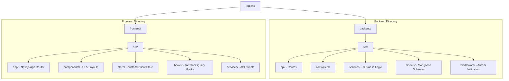

# LogLens

Production-grade log observability, analytics, and AI-powered insights for modern engineering teams.

## 🚀 Overview
LogLens is a comprehensive platform designed for parsing, ingesting, and analyzing large volumes of logs in real-time. It separates concerns between a highly optimized Node.js backend for ingestion/analytics and a robust Next.js frontend for intuitive dashboards.

## 🏗️ Architecture

```mermaid
graph TD
    Client[Web Client - Next.js] -->|REST / API| Backend[Node.js + Express Backend]
    
    subgraph Frontend [Frontend Architecture]
        Client
        Zustand[Zustand - Client State]
        ReactQuery[TanStack Query - Server State]
        Client --- Zustand
        Client --- ReactQuery
    end
    
    subgraph Backend [Backend Services]
        Backend --> Auth[Authentication Service]
        Backend --> Ingestion[Log Ingestion Engine]
        Backend --> Analytics[Analytics Engine]
    end

    subgraph Data [Data Layer]
        Ingestion --> MongoDB[(MongoDB)]
        Auth --> MongoDB
        Analytics --> MongoDB
    end
```

## 📁 Folder Structure



## 🛠️ Tech Stack

### Frontend
- **Framework**: Next.js 16 (App Router)
- **Styling**: Tailwind CSS
- **State Management**:
  - **Server State**: TanStack Query (React Query)
  - **Client/UI State**: Zustand
- **Testing**: Vitest, React Testing Library

### Backend
- **Runtime**: Node.js
- **Framework**: Express.js
- **Database**: MongoDB (Mongoose ORM)
- **Authentication**: JWT (JSON Web Tokens), bcrypt
- **Testing**: Jest, Supertest

## ⚡ Run Commands

### Prerequisites
- Node.js (v18+)
- MongoDB (Local or Atlas)

### 1. Backend Setup
Navigate to the backend directory, install dependencies, and start the development server.

```bash
cd backend
npm install
npm run dev
```

*Note: Ensure you have a `.env` file configured in the `backend/` directory with your `MONGODB_URI` and `JWT_SECRET`.*

### 2. Frontend Setup
In a new terminal window, navigate to the frontend directory.

```bash
cd frontend
npm install
npm run dev
```

*Note: Ensure you have a `.env.local` file configured in the `frontend/` directory with `NEXT_PUBLIC_API_URL`.*

### 3. Running Tests
**Backend Tests:**
```bash
cd backend
npm test
```

**Frontend Tests:**
```bash
cd frontend
npx vitest run
```

## 📈 Phases Completed
- **Phase A-E**: Core Auth, MongoDB Integration, Projects & API Keys.
- **Phase F-G**: Log Ingestion & File Upload Engines.
- **Phase H**: Analytics Engine.
- **Phase I**: Next.js Migration.
- **Phase J**: TanStack Query integration (Server State).
- **Phase K**: Zustand integration (Client State).
