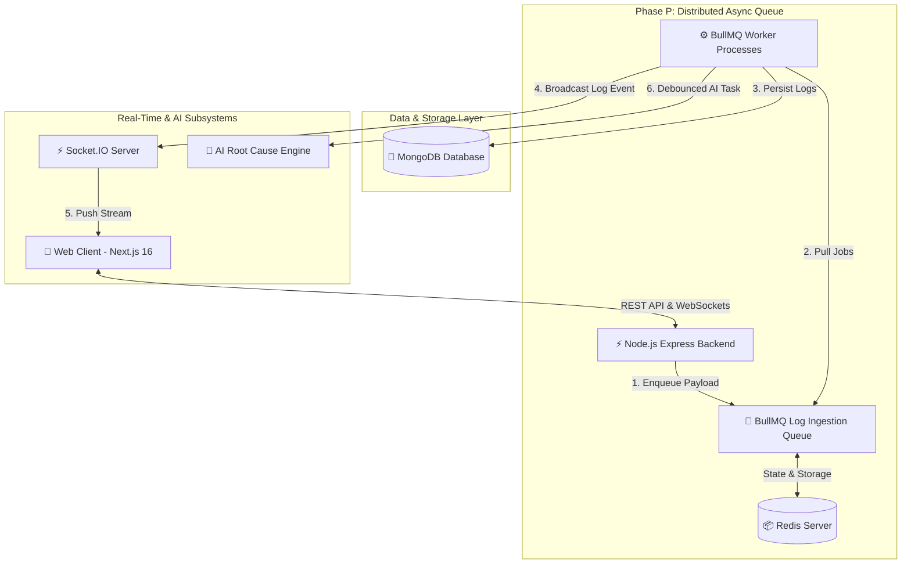
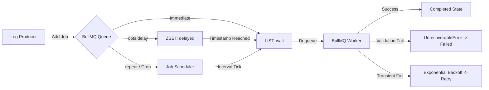

# 🔍 LogLens – Beginner's Handbook & Technical Guide

> **Production-grade AI-Powered Log Monitoring, Real-time Observability, and Distributed Queue Analysis Platform.**

---

## 📖 Welcome to LogLens!

**LogLens** is a full-stack, enterprise-grade log observability platform built to ingest, process, aggregate, and analyze high-volume log streams in real time. 

If you are a beginner backend or full-stack developer, this **Handbook** will walk you step-by-step through how a real-world, scalable log monitoring system works—from HTTP ingestion to distributed message queues, database persistence, real-time WebSockets, and interactive Next.js dashboards.

---

## 🎯 What Problem Does LogLens Solve?

When software applications scale to millions of users, microservices generate millions of log lines per minute. Processing these logs synchronously inside an HTTP request loop crashes web servers and creates extreme latency.

**LogLens solves this using an Asynchronous Distributed Architecture**:
1. **Instant Ingestion**: Log requests are received by the API and immediately enqueued into **Redis / BullMQ** in under `5ms`.
2. **Background Processing**: Independent worker nodes pull jobs from the queue, persist them to **MongoDB**, and calculate analytics without blocking user requests.
3. **AI Root-Cause Analysis**: High-severity error spikes are debounced and processed by AI models to identify bug root causes automatically.
4. **Real-time Streaming**: **Socket.IO** broadcasts new logs and metrics to the **Next.js** web dashboard instantly.

---

## 🏗️ High-Level System Architecture



---

## ⚡ Background Queue Architecture (Phase P Pipeline)



---

## 🛠️ Complete Tech Stack

### Backend Infrastructure (`/backend`)
- **Runtime**: Node.js (TypeScript)
- **API Framework**: Express.js
- **Task Queue & Scheduling**: BullMQ v5 & ioredis
- **In-Memory Cache & Message Broker**: Redis 7+
- **Primary Database**: MongoDB (Mongoose ORM)
- **Real-Time Communication**: Socket.IO (with Redis Adapter for horizontal scaling)
- **Authentication**: JWT (JSON Web Tokens) & API Key Hashing
- **Logging**: Winston Logger
- **Test Framework**: Jest & Supertest

### Frontend Application (`/frontend`)
- **Framework**: Next.js 16 (App Router) & React 19
- **Styling**: Tailwind CSS & Lucide Icons
- **Server State Management**: TanStack Query (React Query v5)
- **Client/UI State Management**: Zustand
- **Data Visualization**: Recharts
- **Real-Time Connection**: Socket.IO Client
- **Test Framework**: Vitest & React Testing Library

---

## 📂 Project Directory Structure (Handbook & Map)

```
loglens/
├── README.md                      <-- Project Overview & Beginner Handbook
├── docker-compose.yml             <-- One-click Redis & MongoDB infrastructure
├── shared/                        <-- Shared TypeScript Contracts & Socket Events
│   └── socket/                    <-- Typed Socket.IO event payloads & room definitions
│
├── backend/                       <-- Node.js + Express + BullMQ Backend Services
│   ├── src/
│   │   ├── api/                   <-- Express HTTP Route Controllers & Handlers
│   │   ├── config/                <-- Environment Variable loaders & Redis config
│   │   ├── controllers/           <-- Request/Response controllers (Auth, Ingestion, Analytics)
│   │   ├── jobs/                  <-- ⚡ Phase P Distributed Queue Architecture
│   │   │   ├── config/            <-- Delay, Retry, and Cron Scheduler Presets
│   │   │   │   ├── delay.config.ts
│   │   │   │   ├── retry.config.ts
│   │   │   │   └── scheduler.config.ts
│   │   │   ├── payloads/          <-- Pass-by-Reference DTO Schemas & Validators
│   │   │   ├── log.queue.ts       <-- BullMQ Queue instance ('log-ingestion')
│   │   │   ├── log.producer.ts    <-- Enqueue helper functions (Immediate, Delayed, Scheduled)
│   │   │   ├── log.scheduler.ts   <-- Job Scheduler registration & management
│   │   │   ├── log.worker.ts      <-- Worker processor router & handlers
│   │   │   ├── test-delayed-jobs.ts    <-- Interactive Delayed Job test script
│   │   │   └── test-repeatable-jobs.ts <-- Interactive Repeatable Job test script
│   │   ├── middleware/            <-- Auth Guard, Rate Limiting, API Key Validation
│   │   ├── models/                <-- Mongoose Database Schemas (Log, Project, User, ApiKey)
│   │   ├── repositories/          <-- Database Access Layer (Data abstraction)
│   │   ├── services/              <-- Business Logic Layer (Analytics computation, Auth)
│   │   ├── socket/                <-- Socket.IO setup, authentication, and room broadcasters
│   │   └── index.ts               <-- Server entry point & graceful shutdown handlers
│   └── package.json
│
└── frontend/                      <-- Next.js 16 App Router Frontend
    ├── src/
    │   ├── app/                   <-- Next.js Pages (Dashboard, Analytics, Projects, Auth)
    │   ├── components/            <-- Reusable UI Components & Charts
    │   ├── features/              <-- Domain-specific Feature modules
    │   ├── hooks/                 <-- Custom TanStack Query & Socket Hooks
    │   ├── providers/             <-- React Context Providers (QueryClient, Auth, Socket)
    │   ├── store/                 <-- Zustand Client UI State management
    │   └── services/              <-- Axios API HTTP Clients
    └── package.json
```

---

## 🎓 Beginner Concepts Guide

### 1. Job Lifecycle in BullMQ
Every job enqueued in LogLens moves through distinct lifecycle states:
- **`delayed`**: Held in Redis ZSET until a delay duration expires or a future timestamp is reached.
- **`waiting`**: Ready in Redis LIST/STREAM for a worker node to process.
- **`active`**: Currently being executed by a worker process.
- **`completed`**: Finished successfully. Job data stored temporarily for audit/monitoring.
- **`failed`**: Encountered an error. Retried automatically if attempts remain, or moved to failed storage.

### 2. Pass-by-Reference Payload Pattern
To optimize Redis memory performance, job payloads store lightweight identifiers (`projectId`, `logId`) and metadata rather than bloated raw objects.

### 3. Non-Recoverable Failure Handling (`UnrecoverableError`)
If a job payload fails schema validation (e.g. invalid version or missing required fields), retrying 3 times will never fix the data format. The worker throws `new UnrecoverableError(...)` to bypass retries and fail the job immediately.

---

## ⚡ Quickstart Guide: Running LogLens Locally

### Prerequisites
Make sure you have the following installed on your machine:
- **Node.js** (v18.0.0 or higher)
- **npm** (v9.0.0 or higher)
- **Docker & Docker Compose** (or local installations of MongoDB & Redis)

---

### Step 1: Start Redis & MongoDB Containers
LogLens includes a ready-to-use `docker-compose.yml` file.

```bash
docker-compose up -d
```
*This starts MongoDB on `localhost:27017` and Redis on `localhost:6379`.*

---

### Step 2: Configure Environment Variables

**Backend Configuration (`backend/.env`):**
```env
PORT=5000
MONGODB_URI=mongodb://localhost:27017/loglens
REDIS_URL=redis://localhost:6379
JWT_SECRET=your_super_secret_jwt_key_here
NODE_ENV=development
```

**Frontend Configuration (`frontend/.env.local`):**
```env
NEXT_PUBLIC_API_URL=http://localhost:5000/api/v1
NEXT_PUBLIC_SOCKET_URL=http://localhost:5000
```

---

### Step 3: Start the Backend Server

```bash
cd backend
npm install
npm run dev
```
*Output:*
```
[INFO] Database connected
[INFO] Redis connected successfully. PING -> PONG
[INFO] BullMQ Queue 'log-ingestion' initialized.
[INFO] Server running on http://localhost:5000
```

---

### Step 4: Start the Frontend Application

In a new terminal window:

```bash
cd frontend
npm install
npm run dev
```
*Open [http://localhost:3000](http://localhost:3000) in your browser.*

---

## 🧪 Testing & Verification Suite

LogLens includes comprehensive integration and automated test suites.

### 1. Run Complete Backend Unit & Integration Tests
```bash
cd backend
npm test
```
*Runs Jest suites verifying Authentication, Log Ingestion, WebSockets, API Keys, Delayed Jobs, and Repeatable Schedulers.*

### 2. Run Interactive Queue Verification Scripts

**Verify Delayed Jobs (Debouncing & Delay States):**
```bash
cd backend
npx ts-node src/jobs/test-delayed-jobs.ts
```

**Verify Repeatable Jobs (Cron Schedulers & Persistence):**
```bash
cd backend
npx ts-node src/jobs/test-repeatable-jobs.ts
```

### 3. Run Frontend Tests
```bash
cd frontend
npx vitest run
```

---

## 📈 Implementation Phases Completed

- ✅ **Phase A-E**: Authentication (JWT), MongoDB Schemas, Projects & API Key Hashing.
- ✅ **Phase F-G**: Ingestion Engine & Log Parsing Pipeline.
- ✅ **Phase H**: Log Analytics & Aggregation Engine.
- ✅ **Phase I-K**: Next.js 16 Migration, TanStack Query (Server State), Zustand (UI State).
- ✅ **Phase L-M**: Real-Time Dashboard UI & Recharts Data Visualization.
- ✅ **Phase N**: Horizontal Socket.IO Infrastructure & Secure WebSocket Room Broadcasting.
- ✅ **Phase P (Current)**: Distributed Task Queue Architecture (BullMQ & Redis)
  - **P1**: Redis Connection Setup & Ping Health Check
  - **P2**: Production Queue Instance (`log-ingestion`)
  - **P3-P4**: Log Producer & Concurrent Worker Processors
  - **P5-P6**: Job Lifecycle Management & Pass-by-Reference Payload DTO Versioning
  - **P7**: Exponential Retry Strategies & `UnrecoverableError` Handling
  - **P8**: Delayed Jobs (Debounced AI Analysis & Alert Cooldowns)
  - **P9**: Repeatable Jobs (`upsertJobScheduler` for Health Check, Analytics, Cleanup)

---

## 📜 API & Event Reference for Developers

### REST Ingestion Endpoint
`POST /api/v1/logs/ingest`

**Headers:**
```json
{
  "Content-Type": "application/json",
  "x-api-key": "loglens_key_live_xxx..."
}
```

**Body:**
```json
{
  "level": "error",
  "message": "Database transaction timeout during checkout",
  "service": "payment-service",
  "metadata": {
    "userId": "usr_9921",
    "cartId": "cart_881"
  }
}
```

### Socket.IO Client Events
- `log:new`: Emitted when a worker finishes processing a log job.
- `analytics:update`: Emitted when analytics metrics re-calculate.

---

## 🤝 Contributing & Support
Feel free to open issues or submit pull requests to enhance LogLens. Happy coding! 🚀
