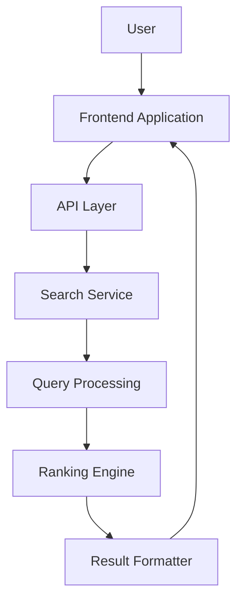

Perfect. We'll build this exactly like an enterprise architecture document.

One important rule I'll follow throughout the entire documentation:

I won't invent features that don't exist in your project. I'll base the documentation on the architecture you've actually built (authentication, Next.js, TanStack Query, Zustand, dashboard architecture, Recharts, search engine, etc.) and present it professionally.

If later you add a new feature, we can revise only the relevant sections instead of rewriting the whole document.

**SEARCH ENGINE PLATFORM**  
Architecture & Design Document

**Version 1.0**  
**Document Type**  
Software Architecture & Design Specification

**Project**  
Enterprise Search Engine Platform

Version

**1.0**  
Status

**Draft**  
**Prepared By**  
**System Architecture Documentation**  
**Purpose**  
This document defines the architecture, design decisions, system components, workflows, and implementation strategy of the Search Engine Platform. It serves as the primary technical reference for developers, maintainers, reviewers, and future contributors.

**Version History**  
Version

**Date**  
**Author**  
Changes

**1.0**  
**July 2026**  
**System Architecture Documentation**  
**Initial Architecture Document**  
**Confidentiality Notice**  
This document describes the internal architecture and implementation of the Search Engine Platform. It is intended as technical documentation for development, maintenance, and architectural understanding. The content may be freely adapted for educational or portfolio purposes.

**Table of Contents**  

# 1. Executive Summary

# 2. Problem Statement

## 2.1 Existing Search Problems

## 2.2 Limitations of Traditional Search

## 2.3 Why This Matters

# 3. Project Objectives

# 4. Project Vision

# 5. Business Justification

# 6. User Personas

# 7. Functional Requirements

# 8. Non-Functional Requirements

# 9. High-Level Architecture

# 10. Component Architecture

# 11. Data Flow Architecture

# 12. Technology Stack

# 13. Search Engine Pipeline Overview

# 14. Security Architecture

# 15. Scalability & Performance

# 16. Database Design

# 17. API Design

# 18. Deployment Architecture

# 19. Monitoring & Observability

# 20. Risks & Mitigation

# 21. Future Roadmap

# 22. Success Metrics

# 23. Conclusion

# 1. Executive Summary

## Introduction

Modern web applications generate and consume enormous amounts of information. As the volume of data increases, users expect search functionality that is fast, accurate, intelligent, and responsive. Simple database filtering or SQL LIKE queries quickly become inadequate when dealing with thousands or millions of records.

The Search Engine Platform is designed to solve this challenge by providing a scalable search architecture capable of efficiently indexing, processing, ranking, and retrieving relevant information. Instead of treating search as a simple database lookup, the platform approaches it as a complete information retrieval system consisting of multiple independent processing stages.

The system is built using a modern full-stack architecture based on the MERN ecosystem together with contemporary frontend technologies and scalable backend services. Each layer of the application has a clearly defined responsibility, allowing the platform to remain modular, maintainable, and extensible as the project grows.

## Core Philosophy

The platform follows four fundamental architectural principles.

# 1. Separation of Responsibilities

Each subsystem performs a single responsibility.

**For example:**  
User Interface handles presentation.

API Layer manages communication.

Search Engine processes queries.

Database stores information.

Cache accelerates retrieval.

Analytics records usage.

This separation minimizes coupling between modules while improving maintainability.

# 2. Modular Architecture

Every major feature is implemented as an independent module.

**Examples include:**  
**Authentication**  
**Search**  
**Indexing**  
**Analytics**  
**Dashboard**  
**User Management**  
**Admin Tools**  
Because modules communicate through well-defined interfaces, new features can be introduced without significantly affecting existing functionality.

# 3. Scalability

The architecture is designed so that individual components can scale independently.

**Examples include:**  
Additional backend instances for increased API traffic.

Dedicated caching servers for frequently accessed queries.

Independent database optimization.

Distributed search infrastructure for large datasets.

This approach enables the system to grow from a small development environment to production-scale deployments.

# 4. Performance-Oriented Design

Performance considerations influence every architectural decision.

**Examples include:**  
Efficient indexing.

Intelligent caching.

Optimized API responses.

Client-side state management.

Lazy loading.

Incremental rendering.

Query optimization.

The objective is to deliver highly responsive search experiences even under increasing workloads.

## Project Overview

The Search Engine Platform consists of several cooperating subsystems that together transform user queries into meaningful search results.

At a high level, the workflow is:

User

```text
↓
Frontend Application
↓
API Layer
↓
Search Service
↓
Query Processing
↓
Ranking Engine
↓
Result Formatter
↓
Frontend Rendering
```




Each subsystem contributes a specialized task, ensuring that search requests move through a predictable and maintainable processing pipeline.

## Primary Goals

The platform has several primary objectives:

Deliver fast search responses.

Produce relevant search rankings.

Support scalable application growth.

Maintain a clean and modular architecture.

Provide a responsive user experience.

Enable future integration of advanced search capabilities.

Simplify maintenance through clear architectural boundaries.

## Target Audience

This document is intended for multiple stakeholders.

|Audience|Purpose|
|---|---|
|Developers|Understand implementation architecture|
|Future Contributors|Learn project organization|
|Interviewers|Evaluate architectural decisions|
|Technical Reviewers|Review design quality|
|Students|Study practical search engine architecture|
|Future Self|Long-term project maintenance|
|Architectural Highlights|The platform emphasizes several key architectural characteristics.|
|Characteristic|Description|
|Modular|Independent feature modules|
|Scalable|Horizontal growth support|
|Maintainable|Clear separation of concerns|
|Performant|Optimized search pipeline|
|Extensible|Easy addition of new capabilities|
|Secure|Authentication and protected resources|
|Observable|Monitoring and analytics support|
|High-Level System Responsibilities|Frontend|
|│|├── User Interface|
|├── Search Experience|├── Dashboard|
|└── Visualization|↓|
|Backend|├── Authentication|
|├── Search API|├── Business Logic|
|├── Analytics|└── Administration|
|↓|Storage|
|├── Primary Database|├── Search Index|
|└── Cache|Expected Outcomes|
|By following the architecture presented in this document, the Search Engine Platform aims to achieve:|Fast query execution.|
|Clean project organization.|Reliable system behavior.|
|Easy future expansion.|Simplified debugging.|
|Improved maintainability.|Consistent user experience.|
|The remaining chapters describe each architectural layer, subsystem, workflow, and implementation decision in detail, providing a complete understanding of how the platform is designed and how its components collaborate to deliver efficient search functionality.|End of Chapter 1|
|Next Chapter: 2. Problem Statement|We'll continue in the same enterprise style, covering:|
|Current search problems|Why traditional database search is insufficient|
|Existing solutions and their limitations|Why your project's architecture addresses those challenges|
|Real-world motivation and design rationale|This will establish the context before moving into the system architecture.|

# 2. Problem Statement

## Introduction

The exponential growth of digital information has fundamentally changed how users interact with applications. Whether searching for products, documentation, articles, projects, or knowledge bases, users expect immediate access to accurate and relevant information. Modern applications are therefore expected to provide search experiences that are not only fast but also intelligent, scalable, and capable of adapting to growing datasets.

Many applications begin with simple database queries for search functionality. While sufficient during the early stages of development, these approaches become increasingly inefficient as the amount of stored data grows. Increased response times, reduced result relevance, higher server load, and poor user experience are common consequences.

The Search Engine Platform addresses these challenges by treating search as a complete processing pipeline rather than a single database operation. Instead of directly querying stored data, user requests pass through multiple specialized stages—including query processing, filtering, ranking, caching, and response formatting—each responsible for a distinct aspect of the search lifecycle.

## 2.1 Current Challenges

As applications evolve, several technical challenges emerge that traditional search approaches struggle to solve.

### Challenge 1 — Large Data Volume

Modern applications often manage thousands or even millions of records. Performing linear searches or broad database scans across such datasets becomes increasingly expensive.

**Problems include:**  
Higher query execution time

**Increased database load**  
**Longer response latency**  
**Reduced scalability**  
Without an optimized search architecture, system performance degrades as the dataset grows.

### Challenge 2 — Poor Result Relevance

Users rarely search using exact database values. They may:

Use incomplete phrases.

Make spelling mistakes.

Use synonyms.

Enter keywords in different orders.

Expect related results.

Simple matching techniques cannot effectively determine which results are most relevant.

**Example:**  
**Database Title**  
**Learning React.js**  
**User Query**  
**react tutorial**  
**Expected Result**  
**Learning React.js**  
A basic equality comparison may fail to recognize the relationship between these terms.

### Challenge 3 — High Database Dependency

When every search request directly queries the primary database, the database becomes the application's performance bottleneck.

**Consequences include:**  
**Increased CPU utilization**  
**Excessive disk reads**  
**Higher network traffic**  
Slower concurrent request handling

As user traffic grows, database performance becomes increasingly difficult to maintain.

### Challenge 4 — Inefficient Repeated Searches

Popular search queries are often repeated many times.

**Examples include:**  
**Trending topics**  
**Frequently searched products**  
**Common documentation pages**  
**Popular tutorials**  
Without caching, the system repeatedly performs identical processing for identical requests.

This leads to unnecessary computation and wasted resources.

### Challenge 5 — Increasing Architectural Complexity

As new functionality is introduced, search logic often becomes scattered across multiple controllers, services, and database queries.

**Examples:**  
**Filtering**  
**Sorting**  
**Pagination**  
**User permissions**  
**Analytics**  
**Recommendations**  
Without proper separation of concerns, maintaining and extending the system becomes increasingly difficult.

### Challenge 6 — Scalability Limitations

A search system should continue to perform efficiently as:

**Users increase**  
**Documents increase**  
**Features increase**  
**Search traffic increases**  
Architectures tightly coupled to a single database query become difficult to scale horizontally.

## Summary of Current Challenges

|Challenge|Impact|
|---|---|
|Large datasets|Slower searches|
|Poor ranking|Less relevant results|
|Heavy database usage|Reduced scalability|
|Repeated processing|Wasted computation|
|Growing complexity|Difficult maintenance|
|Limited scalability|Performance bottlenecks|

## 2.2 Limitations of Traditional Search Approaches

Several common search implementations are frequently used in web applications. While appropriate for simple projects, they present limitations when applied to larger systems.

### Approach 1 — SQL LIKE Queries

**Example:**  
**SELECT ***  
**FROM products**  
WHERE name LIKE '%laptop%';

**Advantages**  
**Simple implementation**  
**No additional infrastructure**  
Suitable for small datasets

**Limitations**  
**Full table scans**  
Poor performance at scale

**No ranking mechanism**  
Weak support for complex search behavior

### Approach 2 — MongoDB Regular Expressions

**Example:**  
**Product.find({**  
title: { $regex: query, $options: "i" }

**});**  
**Advantages**  
**Easy to implement**  
**Flexible matching**  
**Case-insensitive search**  
**Limitations**  
Performance decreases with dataset size

**Limited ranking capabilities**  
**Increased CPU usage**  
Inefficient for high-traffic systems

### Approach 3 — Client-Side Filtering

Some applications load all data into the browser and perform filtering on the client.

**Advantages**  
**Simple architecture**  
Fast for very small datasets

**Limitations**  
**Large network transfers**  
High browser memory usage

**Poor scalability**  
Unsuitable for production-scale applications

### Approach 4 — Direct Database Search

Many applications place search logic directly inside controllers.

**Example:**  
Controller

```text
↓
Database Query
↓
Response
```

While initially straightforward, this design quickly becomes difficult to extend as filtering, ranking, permissions, analytics, and pagination are added.

## Comparison

|Approach|Suitable For|Primary Limitation|
|---|---|---|
|SQL LIKE|Small datasets|Slow at scale|
|MongoDB Regex|Medium datasets|Limited ranking|
|Client Filtering|Tiny datasets|High memory usage|
|Direct Queries|Basic applications|Difficult to maintain|

## 2.3 Why This Problem Matters

Search is one of the most frequently used features in modern software systems. Users often judge the overall quality of an application by how quickly and accurately it returns results.

An effective search experience influences:

**User satisfaction**  
**Productivity**  
**Content discoverability**  
**Application usability**  
**Business value**  
As applications grow, search evolves from a convenience feature into core infrastructure. Poor search performance affects nearly every aspect of the user experience, while well-designed search architecture enables faster workflows, better engagement, and easier system evolution.

For this reason, the Search Engine Platform adopts a pipeline-based architecture in which each stage has a clearly defined responsibility. Query processing, filtering, ranking, caching, and response generation are handled independently, improving maintainability, scalability, and overall system performance.

## Problem Summary

|Aspect|Traditional Systems|Search Engine Platform|
|---|---|---|
|Search Logic|Scattered across controllers|Dedicated search pipeline|
|Ranking|Basic matching|Structured relevance ranking|
|Performance|Database-intensive|Optimized processing stages|
|Scalability|Limited|Modular and extensible|
|Maintainability|Tightly coupled|Clear separation of concerns|
|User Experience|Inconsistent|Fast and predictable|
The core challenge addressed by this project is not simply retrieving records from a database—it is designing a search architecture that remains performant, maintainable, and scalable as both data volume and application complexity increase.

By moving beyond direct database lookups and adopting a structured search pipeline, the platform provides a foundation for advanced capabilities such as intelligent ranking, efficient caching, analytics, and future enhancements without requiring significant architectural changes.

# 3. Project Objectives

## Introduction

Every successful software system begins with a clearly defined set of objectives. These objectives guide architectural decisions, technology selection, implementation priorities, and future development.

The Search Engine Platform is not intended to be merely a feature that retrieves records from a database. Instead, it is designed as a scalable information retrieval system capable of delivering fast, relevant, secure, and maintainable search experiences while supporting future enhancements.

The objectives presented in this chapter define what the platform aims to achieve and provide measurable goals against which the system can be evaluated.

**Primary Objectives**  
The platform is built around six primary objectives.

### Objective 1 — Deliver Fast Search Responses

One of the most important expectations of modern users is speed. Search results should appear almost instantly regardless of the number of records stored in the system.

To achieve this objective, the platform emphasizes:

**Optimized query processing**  
**Efficient database queries**  
**Intelligent caching**  
**Reduced network overhead**  
**Lightweight API responses**  

## Success Criteria

**Minimal response latency**  
Consistent performance under normal load

Reduced unnecessary database operations

### Objective 2 — Provide Relevant Results

Returning data is not enough—the returned information must also be meaningful.

The platform therefore focuses on improving search relevance by supporting:

**Keyword matching**  
**Ranking strategies**  
**Partial matches**  
**Flexible filtering**  
Future semantic search capabilities

The objective is to ensure users find the most useful information first rather than simply receiving matching database records.

### Objective 3 — Build a Modular Architecture

Large applications become difficult to maintain when responsibilities are mixed together.

The Search Engine Platform adopts a modular architecture where every subsystem performs a single responsibility.

**Example:**  
**Authentication**  
**Search**  
**Analytics**  
**Dashboard**  
**Administration**  
**Notifications**  
**Caching**  
Each module evolves independently while communicating through clearly defined interfaces.

**Benefits**  
**Easier maintenance**  
**Independent testing**  
**Better readability**  
**Simpler future expansion**  

### Objective 4 — Enable Scalability

The architecture should continue to perform efficiently as the application grows.

Growth may occur in several dimensions:

**More users**  
**More documents**  
**More API requests**  
**More administrators**  
**More analytics**  
**More dashboards**  
Instead of redesigning the application later, scalability is considered from the beginning.

**Examples include:**  
**Stateless APIs**  
**Independent services**  
**Efficient caching**  
**Optimized database access**  
**Component isolation**  

### Objective 5 — Improve Developer Experience

A project is successful only if developers can understand and extend it efficiently.

The platform therefore emphasizes:

**Clear folder organization**  
**Consistent naming conventions**  
**Reusable components**  
**Centralized business logic**  
**Well-defined APIs**  
**Comprehensive documentation**  
These practices reduce onboarding time for future contributors and simplify long-term maintenance.

### Objective 6 — Support Continuous Growth

Modern applications constantly evolve.

Future enhancements may include:

**AI-assisted search**  
**Recommendation systems**  
**Voice search**  
**Image search**  
**Personalized ranking**  
**Search analytics**  
**Distributed indexing**  
The architecture is intentionally designed to accommodate such features without requiring major restructuring.

**Secondary Objectives**  
In addition to the primary goals, the platform also pursues several supporting objectives.

**Maintain Clean Code**  
The codebase should remain:

**Readable**  
**Consistent**  
**Reusable**  
**Testable**  
**Reduce Coupling**  
Each module should depend as little as possible on others.

**Benefits include:**  
**Easier debugging**  
**Independent development**  
**Better testing**  
**Simpler deployment**  
**Increase Reliability**  
The system should continue operating correctly even when:

**Invalid requests occur**  
**Services fail**  
Users submit unexpected input

**Network interruptions happen**  
Proper validation and error handling improve overall system reliability.

**Enhance User Experience**  
Search should feel:

**Fast**  
**Predictable**  
**Responsive**  
**Easy to use**  
A smooth search experience encourages continued user engagement.

**Encourage Future Innovation**  
Rather than solving only current requirements, the architecture prepares for future technological improvements.

**Potential additions include:**  
**Machine learning ranking**  
**AI-generated summaries**  
**Personalized recommendations**  
**Predictive search**  
**Natural language understanding**  

## Architectural Principles

Every implementation decision follows several guiding principles.

Principle 1 — Separation of Concerns

Each layer performs one responsibility.

Frontend

```text
↓
API
↓
Business Logic
↓
Search Engine
↓
Database
```

No single layer should perform unrelated tasks.

Principle 2 — Reusability

Reusable components reduce duplication and simplify maintenance.

**Examples include:**  
**UI components**  
Services

**Hooks**  
**Utility functions**  
**Validation logic**  
Principle 3 — Maintainability

Future developers should understand the project without extensive explanation.

**The architecture favors:**  
**Consistent naming**  
**Predictable folder structures**  
**Small focused modules**  
**Clear interfaces**  
Principle 4 — Performance First

Performance is considered throughout the application lifecycle.

Areas of optimization include:

**API communication**  
**Rendering**  
**State management**  
**Search processing**  
**Database interaction**  
**Caching**  
Principle 5 — Security by Design

Security is integrated into the architecture rather than added later.

**Key considerations include:**  
**Authentication**  
**Authorization**  
**Input validation**  
**Secure API communication**  
**Protected routes**  
**Environment configuration**  

## Success Criteria

The following objectives provide measurable indicators of project success.

|Objective|Expected Outcome|
|---|---|
|Fast Search|Low response latency|
|Relevant Results|Improved search accuracy|
|Modular Design|Independent feature modules|
|Scalability|Supports future growth|
|Maintainability|Easy to understand and modify|
|Reliability|Stable application behavior|
|Security|Protected resources and validated inputs|
|User Experience|Responsive and intuitive interface|
|Objective Summary|Fast Search|
|↓|Relevant Results|
|↓|Modular Architecture|
|↓|Scalable System|
|↓|Developer Friendly|
|↓|Future Ready|
|These objectives collectively define the long-term direction of the Search Engine Platform. Every architectural choice, technology selection, and implementation strategy described in the following chapters is intended to support one or more of these goals.|Chapter Summary|
|The Search Engine Platform is designed with objectives that extend beyond basic search functionality. Its focus is on creating a system that is performant, maintainable, scalable, secure, and adaptable to future requirements.|By grounding development in these objectives, the platform establishes a strong architectural foundation capable of supporting both current features and future innovations.|
|End of Chapter 3|Next Chapter: 4. Project Vision|
|This chapter will describe the long-term vision of the platform, the architectural direction, evolution roadmap, and how the system can grow from its current implementation into a more comprehensive search and information retrieval platform.|4. Project Vision|
|Introduction|Every software project begins with solving an immediate problem. However, successful systems are designed with a long-term vision that allows them to evolve without requiring major architectural redesigns.|
|The Search Engine Platform is envisioned as more than a simple search feature embedded within a web application. Its long-term goal is to become a modular, scalable, and extensible search infrastructure capable of serving diverse applications, large datasets, and advanced search requirements.|Rather than focusing solely on the current implementation, the platform is designed with architectural principles that support continuous growth, independent feature evolution, and future integration of emerging technologies.|
|Vision Statement|To build a scalable, intelligent, and modular search platform that provides fast, relevant, secure, and extensible information retrieval while serving as a reusable foundation for future applications.|
|This vision influences every architectural decision made throughout the project.|Long-Term Vision|
|The project aims to evolve through multiple stages of maturity.|Each stage expands the platform's capabilities while preserving the overall architecture.|
|Basic Search|↓|
|Structured Search Engine|↓|
|Scalable Search Platform|↓|
|Intelligent Search Platform|↓|
|Enterprise Search Infrastructure|The objective is continuous evolution rather than complete redesign.|
|Vision Pillars|The platform is built around six strategic pillars.|
|Pillar 1 — Intelligent Search|Search should understand user intent rather than simply matching characters.|
|Future improvements may include:|Typo tolerance|
|Synonym recognition|Semantic search|
|Context-aware ranking|Personalized recommendations|
|AI-assisted query understanding|Current implementation establishes the architecture needed to support these capabilities later.|
|Pillar 2 — High Performance|Search performance should remain consistent regardless of application growth.|
|Performance goals include:|Low response latency|
|Efficient indexing|Intelligent caching|
|Optimized database access|Minimal API overhead|
|The platform prioritizes responsiveness as a fundamental user experience requirement.|Pillar 3 — Modular Growth|
|Every subsystem is designed as an independent module.|Example architecture:|
|Authentication|↓|
|User Management|↓|
|Search|↓|
|Analytics|↓|
|Dashboard|↓|
|Administration|New modules should integrate with minimal impact on existing functionality.|
|Pillar 4 — Scalable Architecture|The architecture should support growth in several dimensions simultaneously.|
|Examples include:|More users|
|More search traffic|Larger datasets|
|Additional services|Increased API requests|
|Multiple deployment environments|Rather than optimizing only for today's requirements, the platform is structured for long-term expansion.|
|Pillar 5 — Developer Productivity|The project should remain understandable as it grows.|
|This includes:|Clear folder organization|
|Consistent naming|Reusable components|
|Documented APIs|Standardized architecture|
|Comprehensive technical documentation|Reducing architectural complexity improves long-term maintainability.|
|Pillar 6 — Future Innovation|Technology evolves rapidly.|
|The architecture should remain flexible enough to integrate future technologies without major restructuring.|Potential future capabilities include:|
|AI-powered search assistants|Natural language querying|
|Recommendation engines|Image-based search|
|Voice search|Knowledge graph integration|
|Real-time analytics|Architectural Vision|
|The platform follows a layered architecture in which each layer performs a clearly defined responsibility.|Presentation Layer|
|↓|Application Layer|
|↓|Business Layer|
|↓|Search Layer|
|↓|Data Layer|
|↓|Infrastructure Layer|
|Each layer communicates only through well-defined interfaces.|Benefits include:|
|Reduced coupling|Easier testing|
|Independent scaling|Simpler maintenance|
|Platform Evolution|The platform is expected to evolve through several phases.|
|Version 1 — Foundation|Current scope.|
|Capabilities:|Authentication|
|User management|Dashboard|
|Search functionality|Analytics|
|Responsive frontend|Secure APIs|
|Objective:|Establish a stable architectural foundation.|
|Version 2 — Advanced Search|Planned improvements:|
|Better ranking algorithms|Improved filtering|
|Search suggestions|Autocomplete|
|Query history|Saved searches|
|Enhanced analytics|Focus:|
|Improve search quality and usability.|Version 3 — Intelligent Platform|
|Possible additions:|AI-assisted search|
|Semantic understanding|Personalized ranking|
|Recommendation systems|Behavioral analytics|
|Focus:|Deliver smarter search experiences.|
|Version 4 — Enterprise Platform|Long-term vision.|
|Potential capabilities:|Multi-tenant architecture|
|Distributed indexing|Horizontal scaling|
|Advanced monitoring|High availability|
|Enterprise administration|External integrations|
|Objective:|Transform the project into a reusable enterprise search platform.|
|Evolution Timeline|Version 1|
|Foundation|↓|
|Version 2|Advanced Search|
|↓|Version 3|
|Intelligent Search|↓|
|Version 4|Enterprise Platform|
|Each version builds upon the previous one while maintaining architectural consistency.|Design Philosophy|
|Several principles guide future development.|Incremental Improvement|
|The platform should improve through continuous refinement rather than complete rewrites.|Benefits:|
|Lower development risk|Easier maintenance|
|Better testing|Stable releases|
|Backward Compatibility|Where practical, new features should integrate without breaking existing functionality.|
|Examples include:|Stable APIs|
|Modular services|Versioned endpoints|
|Extensible data models|Technology Independence|
|Architectural design should minimize dependency on specific libraries or frameworks.|This allows components to be replaced or upgraded with minimal impact on the overall system.|
|Maintainability First|The project values long-term maintainability over short-term convenience.|
|This influences decisions regarding:|Folder structure|
|Naming conventions|Code organization|
|Documentation|Module boundaries|
|Future Opportunities|Possible future extensions include:|
|Area|Potential Enhancement|
|Search|Semantic retrieval|
|Ranking|AI-assisted ranking|
|User Experience|Personalized results|
|Analytics|Predictive insights|
|Infrastructure|Distributed search|
|Security|Fine-grained access control|
|Monitoring|Real-time performance dashboards|
|APIs|Public search APIs|
|These opportunities demonstrate that the current architecture is intended as a foundation for future innovation rather than a fixed endpoint.|Vision Summary|
|Fast|↓|
|Modular|↓|
|Scalable|↓|
|Intelligent|↓|
|Enterprise Ready|This progression reflects the long-term direction of the platform.|
The vision of the Search Engine Platform extends beyond implementing a search feature. It aims to establish a scalable, modular, and future-ready architecture capable of supporting increasingly sophisticated search capabilities as the project evolves.

By prioritizing extensibility, maintainability, and performance from the outset, the platform is positioned to grow incrementally—from its current implementation into a comprehensive search infrastructure that can adapt to future requirements without fundamental architectural changes.

In this chapter, we'll explain why this platform is valuable, identify the problems it solves for users and organizations, discuss its practical applications, and present the measurable benefits of adopting this architecture. This mirrors the business-focused section found in enterprise architecture documents while remaining specific to your Search Engine Platform.

# 5. Business Justification & Project Value

## Introduction

Software architecture should not only solve technical problems but also deliver measurable value to its users, developers, and organizations. A well-designed search platform improves productivity, enhances user experience, simplifies system maintenance, and creates a foundation for future innovation.

The Search Engine Platform has been designed with these broader goals in mind. While its immediate purpose is to provide efficient search capabilities, its architectural decisions also support long-term scalability, operational efficiency, and continuous feature growth.

This chapter explains the practical value of the platform and the reasons for adopting its modular search architecture.

## Why This Platform Matters

Information has become one of the most valuable assets within modern software systems. As applications grow, users spend increasing amounts of time searching rather than navigating manually.

Without an effective search system:

Users struggle to locate information.

Productivity decreases.

System complexity increases.

Database workload grows.

User satisfaction declines.

A dedicated search architecture transforms information retrieval from a bottleneck into a competitive advantage.

## Business Problems Addressed

The platform addresses several common challenges faced by modern applications.

Problem 1 — Slow Information Retrieval

As datasets expand, manually browsing content becomes increasingly inefficient.

**Users expect:**  
**Immediate results**  
**Accurate matches**  
**Minimal navigation**  
**Consistent response times**  
The platform reduces search time by providing a structured retrieval pipeline optimized for speed and relevance.

Problem 2 — Reduced User Productivity

Every additional second spent searching reduces overall productivity.

**Typical scenarios include:**  
**Finding documentation**  
**Locating projects**  
**Searching products**  
**Discovering articles**  
**Accessing resources**  
Efficient search enables users to focus on their tasks rather than locating information.

Problem 3 — Growing Operational Complexity

As applications evolve, search requirements expand.

**Examples include:**  
**Filtering**  
**Sorting**  
**Categories**  
**Pagination**  
**Permissions**  
**Analytics**  
Without a dedicated architecture, search logic becomes scattered across multiple components, increasing maintenance costs.

Problem 4 — Increasing Infrastructure Costs

Repeated database searches consume significant computing resources.

**Examples include:**  
**Duplicate queries**  
**Expensive filtering**  
**Full collection scans**  
**Unoptimized requests**  
By introducing optimized query handling and caching strategies, the platform helps reduce unnecessary processing and improves resource utilization.

## Value to Users

The platform directly improves the end-user experience.

**Benefits include:**  
**Faster search**  
**Cleaner interface**  
**Better result relevance**  
**Reduced waiting time**  
**Consistent performance**  
**Improved usability**  
The result is a smoother and more productive interaction with the application.

## Value to Developers

The architecture has been designed to simplify development and long-term maintenance.

**Advantages include:**  
**Modular code organization**  
Clear separation of responsibilities

**Reusable components**  
**Predictable project structure**  
**Easier debugging**  
**Simplified testing**  
Well-defined architectural boundaries allow new features to be added with minimal disruption to existing functionality.

## Value to Organizations

Organizations benefit from software that is easier to maintain, extend, and scale.

**Key advantages include:**  
**Lower maintenance costs**  
**Improved development efficiency**  
**Faster feature delivery**  
**Better scalability**  
**Reduced technical debt**  
**Higher application reliability**  
These benefits contribute to lower long-term operational costs and greater adaptability as business requirements evolve.

## Competitive Advantages

Several characteristics distinguish the Search Engine Platform from basic search implementations.

|Capability|Traditional Search|Search Engine Platform|
|---|---|---|
|Architecture|Direct database queries|Structured search pipeline|
|Scalability|Limited|Modular growth|
|Performance|Database dependent|Optimized processing|
|Maintainability|Mixed responsibilities|Clear separation of concerns|
|Extensibility|Difficult|Designed for expansion|
|User Experience|Basic filtering|Intelligent retrieval workflow|
|Practical Applications|Although developed as a Search Engine Platform, the underlying architecture is applicable to a wide range of systems.|Potential use cases include:|
|Documentation portals|Learning management systems|E-commerce applications|
|Digital libraries|Knowledge bases|Enterprise dashboards|
|Project management platforms|Internal company search systems|Portfolio management applications|
|The modular design allows the search engine to be adapted to different domains with minimal architectural changes.|Technical Value|Beyond user-facing benefits, the platform demonstrates several software engineering best practices.|
|These include:|Layered architecture|Separation of concerns|
|Component modularity|API-first design|Scalable frontend architecture|
|Efficient backend organization|Reusable business logic|Modern state management|
|Production-oriented deployment strategy|These characteristics make the project valuable as both a functional application and a demonstration of sound architectural design.|Long-Term Return on Investment|
|The initial investment in designing a modular search architecture provides long-term benefits.|Examples include:|Reduced refactoring effort|
|Faster onboarding of new developers|Easier feature integration|Improved scalability|
|Better testing capabilities|Lower maintenance overhead|Rather than requiring major redesigns as the application grows, the platform is intended to evolve incrementally.|
|Strategic Benefits|Improved Search|↓|
|Better User Experience|↓|Higher Productivity|
|↓|Simpler Maintenance|↓|
|Scalable Architecture|↓|Future Expansion|
|This progression illustrates how architectural decisions contribute to both technical quality and overall project value.|Business Value Summary|Area|
|Benefit|Users|Faster and more relevant search experience|
|Developers|Modular, maintainable codebase|Organizations|
|Lower maintenance and operational costs|Infrastructure|Efficient resource utilization|
|Future Development|Easy integration of new features|Architecture|
|Scalable and extensible foundation|Chapter Summary|The Search Engine Platform delivers value beyond its core search functionality. By adopting a modular and scalable architecture, it improves user productivity, simplifies software maintenance, and establishes a foundation for future enhancements.|
|Its design supports efficient information retrieval while promoting long-term maintainability, scalability, and developer productivity. These qualities make the platform suitable not only as a functional application but also as a robust architectural foundation for future growth.|End of Chapter 5|Next Chapter: 6. User Personas|
|We'll define the different types of users who interact with the platform (regular users, administrators, developers, and maintainers), describe their goals, responsibilities, and interactions with the system. This helps connect the architecture to real-world usage and aligns the design with user needs before we move into the technical architecture chapters.|6. User Personas|Introduction|
|A successful software platform is designed around the needs of its users rather than solely around technical implementation. Understanding who interacts with the system, what their goals are, and how they use the platform helps ensure that architectural decisions align with real-world requirements.|The Search Engine Platform supports multiple categories of users, each with different responsibilities and expectations. While all users interact with the same application, their permissions, workflows, and objectives differ significantly.|This chapter identifies the primary user personas that influence the platform's architecture and explains how each interacts with the system.|
|User Classification|The platform currently supports four primary user categories.|Users|
|│|├── End User|├── Administrator|
|├── Developer|└── System Maintainer|Each persona interacts with different components of the system while sharing the same underlying architecture.|
|Persona 1 — End User|Overview|The End User represents the primary consumer of the platform. Their objective is to efficiently locate information, interact with search results, and manage their personal account.|
|The success of the platform is largely measured by the quality of this user's experience.|Primary Goals|The End User expects to:|
|Search quickly|Receive relevant results|Navigate easily|
|Save time|Access personalized information|View dashboards and analytics where applicable|
|Typical Activities|Examples include:|Logging into the application|
|Searching for information|Applying filters|Browsing search results|
|Opening result details|Managing account settings|Viewing recent searches|
|Expectations|The End User expects:|Fast response time|
|Responsive interface|Secure authentication|Reliable search results|
|Consistent user experience|Interaction Flow|Login|
|↓|Dashboard|↓|
|Search|↓|Results|
|↓|View Details|↓|
|Continue Searching|System Components Used|Authentication|
|Dashboard|Search Service|Search API|
|User Profile|Analytics (read-only)|Persona 2 — Administrator|
|Overview|Administrators manage platform operations, users, and system configuration. Unlike regular users, administrators have elevated permissions that allow them to oversee application behavior.|Primary Goals|
|Administrators aim to:|Manage users|Monitor application health|
|Review analytics|Configure platform settings|Maintain data quality|
|Resolve operational issues|Typical Activities|Examples include:|
|Viewing user statistics|Managing user accounts|Reviewing system activity|
|Monitoring search performance|Configuring application settings|Accessing administrative dashboards|
|Expectations|Administrators require:|Comprehensive dashboards|
|Secure administrative access|Reliable reporting|Efficient management tools|
|Clear system visibility|Interaction Flow|Login|
|↓|Admin Dashboard|↓|
|User Management|↓|Analytics|
|↓|Configuration|↓|
|Reports|System Components Used|Authentication|
|Admin Dashboard|User Management|Analytics|
|Reporting|System Configuration|Persona 3 — Developer|
|Overview|Developers are responsible for implementing, extending, and maintaining the platform.|Although developers are not typical application users, the architecture is intentionally designed to improve their productivity.|
|Primary Goals|Developers aim to:|Add features|
|Fix bugs|Improve performance|Maintain architecture|
|Extend search capabilities|Deploy updates|Typical Activities|
|Examples include:|Writing frontend components|Building APIs|
|Creating services|Implementing business logic|Optimizing database queries|
|Improving search algorithms|Expectations|Developers benefit from:|
|Modular architecture|Clear documentation|Consistent folder structure|
|Reusable components|Predictable project organization|Interaction Flow|
|Read Documentation|↓|Implement Feature|
|↓|Test|↓|
|Review|↓|Deploy|
|System Components Used|Entire codebase|API layer|
|Database|Frontend|Backend|
|Build system|Persona 4 — System Maintainer|Overview|
|The System Maintainer focuses on ensuring long-term stability, reliability, and operational health.|Responsibilities include monitoring production systems, diagnosing issues, and maintaining deployment infrastructure.|Primary Goals|
|Maintainers aim to:|Ensure uptime|Monitor performance|
|Detect issues|Deploy updates|Manage infrastructure|
|Improve reliability|Typical Activities|Examples include:|
|Monitoring logs|Reviewing metrics|Checking server health|
|Managing deployments|Backing up data|Updating dependencies|
|Expectations|System Maintainers require:|Reliable monitoring|
|Clear logging|Automated deployment|Stable infrastructure|
|Efficient troubleshooting|Interaction Flow|Monitor|
|↓|Detect Issue|↓|
|Investigate|↓|Resolve|
|↓|Verify|↓|
|Continue Monitoring|System Components Used|Monitoring|
|Logging|Deployment|Infrastructure|
|Database|Server Environment|Permission Overview|
|Different personas interact with the platform using different permission levels.|Persona|Search|
|Dashboard|User Management|System Settings|
|Deployment|End User|✅|
|✅|❌|❌|
|❌|Administrator|✅|
|✅|✅|✅|
|❌|Developer|✅|
|✅|Limited|Limited|
|Development Only|System Maintainer|Limited|
|Monitoring|Limited|Infrastructure|
|✅|User Journey Overview|The following diagram illustrates how different users enter and interact with the platform.|
|Application|│|├── End User|
|│ │|│ ├── Search|│ ├── Dashboard|
|│ └── Profile|│|├── Administrator|
|│ │|│ ├── Analytics|│ ├── Users|
|│ └── Settings|│|├── Developer|
|│ │|│ ├── Code|│ ├── APIs|
|│ └── Database|│|└── Maintainer|
|│|├── Monitoring|├── Deployment|
|└── Infrastructure|Architectural Influence|Understanding these personas influences several architectural decisions.|
|Examples include:|Authentication and authorization|Role-based access control|
|Dashboard customization|API security|Monitoring strategy|
|Logging requirements|Deployment workflows|By defining user personas early, the platform ensures that both functional and non-functional requirements remain aligned with real-world usage.|
|Persona Summary|Persona|Primary Responsibility|
|Main System Interaction|End User|Search and consume information|
|Search, Dashboard, Profile|Administrator|Manage platform operations|
|Admin Dashboard, Analytics, Users|Developer|Build and improve the application|
|Codebase, APIs, Database|System Maintainer|Ensure operational reliability|
|Monitoring, Deployment, Infrastructure|Chapter Summary|The Search Engine Platform is designed to support multiple user personas, each with distinct responsibilities and system interactions. Recognizing these roles ensures that the architecture addresses not only technical requirements but also the practical needs of those who use, manage, develop, and maintain the platform.|
|By incorporating role-specific workflows and permissions into the architectural design, the platform remains secure, scalable, and adaptable as new features and user types are introduced.|End of Chapter 6|Next Chapter: 7. Functional Requirements|
|This chapter will shift from who uses the system to what the system must do. It will present a comprehensive list of functional requirements (FR-01, FR-02, etc.), each with descriptions, priorities, dependencies, and acceptance criteria—following the same enterprise-style specification found in professional architecture documents. This chapter becomes the bridge between the business-oriented sections and the technical architecture that follows.|7. Functional Requirements|Introduction|
|Functional requirements define what the system must do to satisfy user needs and business objectives. Unlike architectural or technical discussions, these requirements describe the expected behavior of the platform from a functional perspective.|Each functional requirement represents a capability that contributes to the overall operation of the Search Engine Platform. These requirements serve as the foundation for system design, implementation, testing, and future enhancements.|To improve traceability, every requirement is assigned a unique identifier, priority level, dependencies, and acceptance criteria.|
|Requirement Classification|The platform's functionality is organized into the following categories:|Authentication|
|↓|User Management|↓|
|Search|↓|Dashboard|
|↓|Analytics|↓|
|Administration|↓|Notifications|
|↓|System Services|Each category contains one or more functional requirements.|
|Functional Requirements Specification|ID|Requirement|
|Priority|FR-01|User Authentication|
|Must Have|FR-02|Secure Session Management|
|Must Have|FR-03|User Registration|
|Must Have|FR-04|User Profile Management|
|Must Have|FR-05|Search Processing|
|Must Have|FR-06|Search Result Ranking|
|Must Have|FR-07|Dashboard Visualization|
|Must Have|FR-08|Analytics Collection|
|Should Have|FR-09|Role-Based Access Control|
|Must Have|FR-10|Protected API Access|
|Must Have|FR-11|Search History|
|Should Have|FR-12|Responsive User Interface|
|Must Have|FR-13|Error Handling|
|Must Have|FR-14|Logging & Audit Events|
|Should Have|FR-15|System Monitoring|
|Could Have|FR-16|Notification Support|
|Could Have|FR-17|Administrative Dashboard|
|Should Have|FR-18|Future Search Extensions|
|Could Have|FR-01 — User Authentication|Description|
|The platform shall authenticate users before granting access to protected resources.|Authentication verifies user identity using secure credentials and establishes an authenticated session.|Priority|
|Must Have|Dependencies|User Database|
|Authentication Service|Session Management|Acceptance Criteria|
|Users can log in successfully.|Invalid credentials are rejected.|Authenticated sessions are created.|
|Unauthorized users cannot access protected resources.|FR-02 — Secure Session Management|Description|
|The platform shall securely manage authenticated user sessions throughout their interaction with the application.|Sessions should persist until expiration or logout while protecting user identity.|Priority|
|Must Have|Acceptance Criteria|Session created after login.|
|Session validated for protected requests.|Session destroyed after logout.|Expired sessions rejected.|

### FR-03 — User Registration

### Description

The system shall allow new users to create an account after providing valid registration information.

Input validation must occur before account creation.

### Priority

**Must Have**  

### Acceptance Criteria

Required fields validated.

Duplicate accounts prevented.

New account stored successfully.

User receives confirmation.

### FR-04 — User Profile Management

### Description

Authenticated users shall be able to manage their personal profile information.

**Typical operations include:**  
**View profile**  
**Update profile**  
**Change password**  
**Update preferences**  

### Priority

**Must Have**  

### Acceptance Criteria

Users access only their profile.

Updates validated.

Changes persist successfully.

### FR-05 — Search Processing

### Description

The platform shall process user search requests and retrieve relevant information.

The search pipeline includes:

Receive Query

```text
↓
Validate
↓
Normalize
↓
Search
↓
Rank
↓
Return Results
Priority
Must Have
Acceptance Criteria
Valid queries processed.
Invalid queries rejected.
Results returned successfully.
```

Response generated within acceptable latency.

### FR-06 — Search Result Ranking

### Description

The platform shall prioritize the most relevant search results before returning them to the user.

Ranking mechanisms may evolve over time while preserving the same API contract.

### Priority

**Must Have**  

### Acceptance Criteria

Results sorted consistently.

Higher relevance displayed first.

Stable ordering maintained.

### FR-07 — Dashboard Visualization

### Description

The system shall provide interactive dashboards for displaying application information, analytics, and user-specific data.

**Examples include:**  
**Statistics**  
**Charts**  
**Search metrics**  
**Recent activity**  

### Priority

**Must Have**  

### Acceptance Criteria

Dashboard loads successfully.

Visualizations render correctly.

Data updates appropriately.

### FR-08 — Analytics Collection

### Description

The platform shall collect operational metrics for reporting and analysis.

**Examples include:**  
**Search frequency**  
**Popular queries**  
**User activity**  
**Dashboard usage**  

### Priority

**Should Have**  

### Acceptance Criteria

Events recorded successfully.

Metrics available for reporting.

### FR-09 — Role-Based Access Control

### Description

Different users shall have different permissions based on assigned roles.

Example:

Guest

```text
↓
User
↓
Administrator
↓
System Maintainer
Priority
Must Have
Acceptance Criteria
Unauthorized actions blocked.
Role permissions enforced.
Protected routes secured.
```

### FR-10 — Protected API Access

### Description

Sensitive API endpoints shall require authenticated requests.

**Examples include:**  
**User management**  
**Dashboard data**  
**Administrative actions**  

### Priority

**Must Have**  

### Acceptance Criteria

Unauthorized requests rejected.

Valid authentication accepted.

API responses follow authorization rules.

### FR-11 — Search History

### Description

The platform may maintain previous search activities for authenticated users.

**Potential capabilities include:**  
**Recent searches**  
**Frequently searched items**  
**Saved searches**  

### Priority

**Should Have**  

### Acceptance Criteria

Search history stored correctly.

Users access only their own history.

### FR-12 — Responsive User Interface

### Description

The application shall support multiple screen sizes while maintaining consistent functionality.

**Supported environments include:**  
**Desktop**  
**Laptop**  
**Tablet**  
**Mobile**  

### Priority

**Must Have**  

### Acceptance Criteria

Layout adapts correctly.

Navigation remains functional.

Interactive elements remain accessible.

### FR-13 — Error Handling

### Description

The platform shall gracefully handle unexpected situations.

**Examples:**  
**Invalid input**  
**Missing resources**  
**Authentication failures**  
**Server errors**  

### Priority

**Must Have**  

### Acceptance Criteria

Friendly error messages displayed.

System remains stable.

Errors logged appropriately.

### FR-14 — Logging & Audit Events

### Description

Important application events shall be recorded for debugging and auditing purposes.

**Examples:**  
**Authentication events**  
**Administrative actions**  
**System errors**  
**Search requests**  

### Priority

**Should Have**  

### Acceptance Criteria

Events recorded consistently.

Logs available for troubleshooting.

### FR-15 — System Monitoring

### Description

The application should expose operational metrics for monitoring platform health.

**Examples include:**  
**API latency**  
**Error rates**  
**Request volume**  
**Resource utilization**  

### Priority

**Could Have**  

### FR-16 — Notification Support

### Description

The system may notify users regarding important platform events.

**Examples:**  
**Password updates**  
**Account changes**  
**Administrative notifications**  

### Priority

**Could Have**  

### FR-17 — Administrative Dashboard

### Description

Administrators shall have access to dashboards containing operational information.

**Examples:**  
**User statistics**  
**Search statistics**  
**System health**  
**Activity summaries**  

### Priority

**Should Have**  

### Acceptance Criteria

Dashboard loads correctly.

Only administrators can access it.

### FR-18 — Future Search Extensions

### Description

The architecture shall support future search enhancements without requiring major redesign.

**Examples include:**  
**Semantic search**  
**AI-assisted search**  
**Recommendation engines**  
**Personalized ranking**  

### Priority

**Could Have**  

### Acceptance Criteria

Architecture remains extensible.

New capabilities integrate through existing interfaces.

**Functional Requirement Dependencies**  
Authentication

```text
↓
Authorization
↓
API Access
↓
Search
↓
Dashboard
↓
Analytics
↓
Administration
```

This dependency chain illustrates how foundational capabilities support higher-level features.

**Functional Requirement Summary**  
**Category**  
**Requirements**  
**Authentication**  

### FR-01, FR-02, FR-03

User Management

### FR-04

**Search**  

### FR-05, FR-06, FR-11, FR-18

**Dashboard**  

### FR-07, FR-17

**Security**  

### FR-09, FR-10

**User Experience**  

### FR-12, FR-13

**Operations**  

### FR-14, FR-15, FR-16

The functional requirements define the essential capabilities of the Search Engine Platform. They establish a structured specification for authentication, search, dashboards, security, user management, analytics, and operational services while also identifying opportunities for future expansion.

Each requirement serves as a measurable implementation target and provides a reference point for architecture, development, testing, and validation. Collectively, these requirements ensure that the platform satisfies both current user needs and anticipated future growth.

This chapter will specify how well the platform should perform rather than what it should do. It will define measurable qualities such as performance, scalability, reliability, security, maintainability, usability, availability, portability, observability, and testability—similar to enterprise architecture documents and directly supporting the implementation decisions described in later chapters.

# 7. Functional Requirements

## Introduction

Functional requirements define what the system must do to satisfy user needs and business objectives. Unlike architectural or technical discussions, these requirements describe the expected behavior of the platform from a functional perspective.

Each functional requirement represents a capability that contributes to the overall operation of the Search Engine Platform. These requirements serve as the foundation for system design, implementation, testing, and future enhancements.

To improve traceability, every requirement is assigned a unique identifier, priority level, dependencies, and acceptance criteria.

## Requirement Classification

The platform's functionality is organized into the following categories:

Authentication

```text
↓
User Management
↓
Search
↓
Dashboard
↓
Analytics
↓
Administration
↓
Notifications
↓
System Services
```

Each category contains one or more functional requirements.

## Functional Requirements Specification

|ID|Requirement|Priority|
|---|---|---|

### FR-01

**User Authentication**  
Must Have

### FR-02

**Secure Session Management**  
Must Have

### FR-03

**User Registration**  
Must Have

### FR-04

**User Profile Management**  
Must Have

### FR-05

**Search Processing**  
Must Have

### FR-06

**Search Result Ranking**  
Must Have

### FR-07

**Dashboard Visualization**  
Must Have

### FR-08

**Analytics Collection**  
Should Have

### FR-09

**Role-Based Access Control**  
Must Have

### FR-10

**Protected API Access**  
Must Have

### FR-11

**Search History**  
Should Have

### FR-12

**Responsive User Interface**  
Must Have

### FR-13

**Error Handling**  
Must Have

### FR-14

Logging & Audit Events

Should Have

### FR-15

**System Monitoring**  
Could Have

### FR-16

**Notification Support**  
Could Have

### FR-17

**Administrative Dashboard**  
Should Have

### FR-18

**Future Search Extensions**  
**Could Have**  

### FR-01 — User Authentication

### Description

The platform shall authenticate users before granting access to protected resources.

Authentication verifies user identity using secure credentials and establishes an authenticated session.

### Priority

**Must Have**  

### Dependencies

**User Database**  
**Authentication Service**  
**Session Management**  

### Acceptance Criteria

Users can log in successfully.

Invalid credentials are rejected.

Authenticated sessions are created.

Unauthorized users cannot access protected resources.

### FR-02 — Secure Session Management

### Description

The platform shall securely manage authenticated user sessions throughout their interaction with the application.

Sessions should persist until expiration or logout while protecting user identity.

### Priority

**Must Have**  

### Acceptance Criteria

Session created after login.

Session validated for protected requests.

Session destroyed after logout.

Expired sessions rejected.

### FR-03 — User Registration

### Description

The system shall allow new users to create an account after providing valid registration information.

Input validation must occur before account creation.

### Priority

**Must Have**  

### Acceptance Criteria

Required fields validated.

Duplicate accounts prevented.

New account stored successfully.

User receives confirmation.

### FR-04 — User Profile Management

### Description

Authenticated users shall be able to manage their personal profile information.

**Typical operations include:**  
**View profile**  
**Update profile**  
**Change password**  
**Update preferences**  

### Priority

**Must Have**  

### Acceptance Criteria

Users access only their profile.

Updates validated.

Changes persist successfully.

### FR-05 — Search Processing

### Description

The platform shall process user search requests and retrieve relevant information.

The search pipeline includes:

Receive Query

```text
↓
Validate
↓
Normalize
↓
Search
↓
Rank
↓
Return Results
Priority
Must Have
Acceptance Criteria
Valid queries processed.
Invalid queries rejected.
Results returned successfully.
```

Response generated within acceptable latency.

### FR-06 — Search Result Ranking

### Description

The platform shall prioritize the most relevant search results before returning them to the user.

Ranking mechanisms may evolve over time while preserving the same API contract.

### Priority

**Must Have**  

### Acceptance Criteria

Results sorted consistently.

Higher relevance displayed first.

Stable ordering maintained.

### FR-07 — Dashboard Visualization

### Description

The system shall provide interactive dashboards for displaying application information, analytics, and user-specific data.

**Examples include:**  
**Statistics**  
**Charts**  
**Search metrics**  
**Recent activity**  

### Priority

**Must Have**  

### Acceptance Criteria

Dashboard loads successfully.

Visualizations render correctly.

Data updates appropriately.

### FR-08 — Analytics Collection

### Description

The platform shall collect operational metrics for reporting and analysis.

**Examples include:**  
**Search frequency**  
**Popular queries**  
**User activity**  
**Dashboard usage**  

### Priority

**Should Have**  

### Acceptance Criteria

Events recorded successfully.

Metrics available for reporting.

### FR-09 — Role-Based Access Control

### Description

Different users shall have different permissions based on assigned roles.

Example:

Guest

```text
↓
User
↓
Administrator
↓
System Maintainer
Priority
Must Have
Acceptance Criteria
Unauthorized actions blocked.
Role permissions enforced.
Protected routes secured.
```

### FR-10 — Protected API Access

### Description

Sensitive API endpoints shall require authenticated requests.

**Examples include:**  
**User management**  
**Dashboard data**  
**Administrative actions**  

### Priority

**Must Have**  

### Acceptance Criteria

Unauthorized requests rejected.

Valid authentication accepted.

API responses follow authorization rules.

### FR-11 — Search History

### Description

The platform may maintain previous search activities for authenticated users.

**Potential capabilities include:**  
**Recent searches**  
**Frequently searched items**  
**Saved searches**  

### Priority

**Should Have**  

### Acceptance Criteria

Search history stored correctly.

Users access only their own history.

### FR-12 — Responsive User Interface

### Description

The application shall support multiple screen sizes while maintaining consistent functionality.

**Supported environments include:**  
**Desktop**  
**Laptop**  
**Tablet**  
**Mobile**  

### Priority

**Must Have**  

### Acceptance Criteria

Layout adapts correctly.

Navigation remains functional.

Interactive elements remain accessible.

### FR-13 — Error Handling

### Description

The platform shall gracefully handle unexpected situations.

**Examples:**  
**Invalid input**  
**Missing resources**  
**Authentication failures**  
**Server errors**  

### Priority

**Must Have**  

### Acceptance Criteria

Friendly error messages displayed.

System remains stable.

Errors logged appropriately.

### FR-14 — Logging & Audit Events

### Description

Important application events shall be recorded for debugging and auditing purposes.

**Examples:**  
**Authentication events**  
**Administrative actions**  
**System errors**  
**Search requests**  

### Priority

**Should Have**  

### Acceptance Criteria

Events recorded consistently.

Logs available for troubleshooting.

### FR-15 — System Monitoring

### Description

The application should expose operational metrics for monitoring platform health.

**Examples include:**  
**API latency**  
**Error rates**  
**Request volume**  
**Resource utilization**  

### Priority

**Could Have**  

### FR-16 — Notification Support

### Description

The system may notify users regarding important platform events.

**Examples:**  
**Password updates**  
**Account changes**  
**Administrative notifications**  

### Priority

**Could Have**  

### FR-17 — Administrative Dashboard

### Description

Administrators shall have access to dashboards containing operational information.

**Examples:**  
**User statistics**  
**Search statistics**  
**System health**  
**Activity summaries**  

### Priority

**Should Have**  

### Acceptance Criteria

Dashboard loads correctly.

Only administrators can access it.

### FR-18 — Future Search Extensions

### Description

The architecture shall support future search enhancements without requiring major redesign.

**Examples include:**  
**Semantic search**  
**AI-assisted search**  
**Recommendation engines**  
**Personalized ranking**  

### Priority

**Could Have**  

### Acceptance Criteria

Architecture remains extensible.

New capabilities integrate through existing interfaces.

**Functional Requirement Dependencies**  
Authentication

```text
↓
Authorization
↓
API Access
↓
Search
↓
Dashboard
↓
Analytics
↓
Administration
```

This dependency chain illustrates how foundational capabilities support higher-level features.

**Functional Requirement Summary**  
**Category**  
**Requirements**  
**Authentication**  

### FR-01, FR-02, FR-03

User Management

### FR-04

**Search**  

### FR-05, FR-06, FR-11, FR-18

**Dashboard**  

### FR-07, FR-17

**Security**  

### FR-09, FR-10

**User Experience**  

### FR-12, FR-13

**Operations**  

### FR-14, FR-15, FR-16

The functional requirements define the essential capabilities of the Search Engine Platform. They establish a structured specification for authentication, search, dashboards, security, user management, analytics, and operational services while also identifying opportunities for future expansion.

Each requirement serves as a measurable implementation target and provides a reference point for architecture, development, testing, and validation. Collectively, these requirements ensure that the platform satisfies both current user needs and anticipated future growth.

This chapter will specify how well the platform should perform rather than what it should do. It will define measurable qualities such as performance, scalability, reliability, security, maintainability, usability, availability, portability, observability, and testability—similar to enterprise architecture documents and directly supporting the implementation decisions described in later chapters.

# 8. Non-Functional Requirements

## Introduction

While functional requirements define what the system does, non-functional requirements define how well the system performs those functions.

These requirements establish the quality attributes of the Search Engine Platform, ensuring that it remains reliable, secure, scalable, maintainable, and performant under different operating conditions.

Unlike functional requirements, which describe specific system capabilities, non-functional requirements influence architectural decisions, infrastructure planning, technology selection, and operational practices throughout the project lifecycle.

**Quality Attributes Overview**  
The Search Engine Platform has been designed around the following quality attributes.

Performance

```text
↓
Scalability
↓
Reliability
↓
Security
↓
Maintainability
↓
Availability
↓
Usability
↓
Observability
↓
Portability
↓
Testability
```

Together, these characteristics determine the overall quality of the platform.

Non-Functional Requirements Specification

|ID|Requirement|Priority|NFR-01|Performance|Must Have|NFR-02|Scalability|Must Have|NFR-03|Reliability|Must Have|NFR-04|Security|Must Have|NFR-05|Maintainability|Must Have|NFR-06|Availability|Should Have|NFR-07|Usability|Must Have|NFR-08|Portability|Should Have|NFR-09|Observability|Should Have|NFR-10|Testability|Must Have|NFR-11|Extensibility|Must Have|NFR-12|Documentation|Must Have|NFR-01 — Performance|Description|
|---|---|---|---|---|---|---|---|---|---|---|---|---|---|---|---|---|---|---|---|---|---|---|---|---|---|---|---|---|---|---|---|---|---|---|---|---|---|---|---|---|
|The platform shall provide responsive search experiences while maintaining efficient resource utilization.|Performance considerations apply to:|Search processing|API communication|Database operations|Dashboard rendering|State management|Frontend rendering|Design Goals|The system should:|Minimize response latency|Reduce unnecessary rendering|Optimize database access|Reduce network overhead|Cache repeated requests|Performance Targets|Metric|Target|Search Response|< 500 ms (typical workload)|API Response|< 300 ms (typical CRUD operations)|Dashboard Load|< 2 seconds|Authentication|< 500 ms|UI Interaction|Immediate visual feedback|NFR-02 — Scalability|Description|The platform shall continue operating efficiently as usage increases.|Growth may occur in:|Users|Documents|Search requests|Dashboards|Analytics|API traffic|Scalability Strategy|Users Increase|↓|
|Backend Instances|↓|Database Optimization|↓|Caching|↓|Load Distribution|Objectives|The architecture should support:|Horizontal scaling|Independent services|Stateless APIs|Modular components|Efficient caching|NFR-03 — Reliability|Description|The platform shall operate consistently under normal conditions while recovering gracefully from failures.|Examples include:|Invalid requests|Database errors|API failures|Authentication failures|Unexpected exceptions|Reliability Goals|The system should:|Prevent crashes|Return meaningful error messages|Recover when possible|Preserve application stability|Error Handling Strategy|Request|↓|Validation|↓|Processing|↓|Success|or|Graceful Error Response|NFR-04 — Security|Description|
|Security is integrated throughout the architecture rather than added after implementation.|Security applies to:|Authentication|Authorization|API protection|Input validation|Session management|Sensitive data|Security Objectives|The platform should:|Authenticate users securely|Restrict protected resources|Validate all input|Prevent unauthorized access|Protect sensitive information|Security Layers|Authentication|↓|Authorization|↓|Validation|↓|Business Logic|↓|Database|Each layer contributes to the overall security posture.|NFR-05 — Maintainability|Description|The project shall remain understandable and easy to modify throughout its lifecycle.|Maintainability influences:|Folder structure|Module organization|Naming conventions|Documentation|Code reuse|Design Principles|The project emphasizes:|Small focused modules|Clear interfaces|Reusable utilities|Consistent architecture|
|Separation of concerns|Expected Benefits|Easier debugging|Faster feature development|Reduced technical debt|Simplified onboarding|NFR-06 — Availability|Description|The platform should remain accessible whenever users need it.|Availability includes:|Stable server operation|Reliable authentication|Consistent API responses|Resilient frontend behavior|Availability Objectives|The system should minimize:|Unexpected downtime|Service interruptions|Failed requests|NFR-07 — Usability|Description|Users should be able to complete tasks efficiently without unnecessary complexity.|The user interface should be:|Simple|Consistent|Responsive|Predictable|Usability Goals|Users should quickly understand:|Navigation|Search|Dashboard|Settings|Authentication flow|NFR-08 — Portability|Description|The application should operate across different development and deployment environments.|Supported environments include:|Local development|Docker|Cloud deployment|
|Linux servers|Windows development|macOS development|Portability Strategy|Avoid environment-specific implementation wherever practical.|Use:|Environment variables|Standard tooling|Containerization|Portable build processes|NFR-09 — Observability|Description|The platform should provide sufficient operational visibility to support debugging, monitoring, and maintenance.|Observability includes:|Logging|Metrics|Error tracking|Performance monitoring|Operational Metrics|Examples include:|Request count|API latency|Error rate|Authentication failures|Search frequency|Monitoring Flow|Application|↓|Logs|↓|Metrics|↓|Monitoring Dashboard|↓|Alerts|NFR-10 — Testability|Description|Every major subsystem should be testable independently.|Testing should include:|Unit testing|Integration testing|
|API testing|UI testing|Benefits|Improved:|Reliability|Regression detection|Code quality|Deployment confidence|NFR-11 — Extensibility|Description|The architecture shall support future enhancements without major restructuring.|Potential future additions include:|AI search|Semantic search|Recommendation systems|Voice search|Image search|Multi-language support|Extensibility Strategy|Existing Module|↓|New Feature|↓|Independent Integration|↓|Minimal Changes|NFR-12 — Documentation|Description|Technical documentation shall accompany the project to support development, maintenance, and future expansion.|Documentation includes:|Architecture|APIs|Database|Deployment|Algorithms|Internal workflows|Documentation Goals|Ensure that future contributors can understand:|System architecture|Project organization|Data flow|
|Component interactions|Design decisions|Non-Functional Requirement Summary|Category|Goal|Performance|Fast response times|Scalability|Support application growth|Reliability|Stable operation|Security|Protected resources|Maintainability|Easy long-term development|Availability|Consistent access|Usability|Intuitive experience|Portability|Cross-environment compatibility|Observability|Monitoring and diagnostics|Testability|Independent verification|Extensibility|Future feature integration|Documentation|Knowledge preservation|Architectural Quality Model|Performance|│|Security │ Reliability|│|Maintainability|│|Scalability|│|Extensibility|│|Future Growth|
|This model illustrates how the platform's quality attributes reinforce one another. Strong maintainability supports extensibility, while good observability contributes to reliability and operational stability.|Chapter Summary|The non-functional requirements establish the quality standards that guide the architecture of the Search Engine Platform. Rather than focusing on specific features, these requirements define how the system should perform, how it should scale, how it should be maintained, and how it should operate in production.|By considering performance, scalability, security, maintainability, reliability, observability, and extensibility from the outset, the platform is designed to remain robust and adaptable as both the codebase and user base evolve.|End of Chapter 8|Next Chapter: 9. High-Level Architecture|This is where the document shifts into the core technical design. We'll introduce the complete system architecture, explain each major subsystem, describe how data flows between them, define architectural boundaries, and present the overall component interactions. From this chapter onward, the documentation becomes much more implementation-focused, closely resembling professional architecture specifications.|Before we continue, I want to point out something important about the direction of the document.|The first 8 chapters we've written are intentionally generic because they cover business context, objectives, and quality attributes. Starting with Chapter 9 (High-Level Architecture), we should stop being generic and make the document match your actual project.|Based on our previous conversations, your project includes:|MERN architecture|Next.js frontend|Express.js backend|MongoDB|JWT Authentication|Zustand|TanStack Query|Recharts|Dashboard|Search System|Analytics|Role-based Authentication|Docker|GitHub Actions|AWS Deployment (planned)|So from this chapter onward, I'll document your real architecture, not a hypothetical search engine. This will make the final PDF much stronger for interviews and your portfolio.|9. High-Level Architecture|Introduction|The Search Engine Platform is designed as a modern, layered web application that separates presentation, business logic, data management, and infrastructure into independent architectural layers. Each layer has a clearly defined responsibility and communicates with adjacent layers through well-defined interfaces.|Rather than concentrating all application logic inside controllers or frontend components, the platform distributes responsibilities across specialized modules, improving maintainability, scalability, and testability.|The architecture follows a client-server model enhanced with modern state management, API abstraction, caching, analytics, and modular feature organization.|Architectural Goals|The high-level architecture has been designed to achieve the following objectives:|Separate frontend and backend concerns.|Minimize coupling between modules.|Improve maintainability.|Support independent feature development.|Enable future scalability.|Simplify deployment.|Improve developer productivity.|Overall System Architecture|
|Users|│|▼|Next.js Frontend|│|┌─────────────┴─────────────┐|│ │|▼ ▼|Zustand UI State TanStack Query|│ Server State Cache|└─────────────┬─────────────┘|▼|API Service Layer|│|HTTPS / REST API|│|┌─────────────┴─────────────┐|▼ ▼|Authentication Search APIs|│ │|├─────────────┬─────────────┤|▼ ▼ ▼|Dashboard Analytics User Services|│|Business Services|│|MongoDB Database|This architecture separates client-side presentation from backend business logic while allowing each subsystem to evolve independently.|Architectural Layers|The platform is divided into six primary layers.|Presentation Layer|↓|State Management Layer|↓|API Communication Layer|↓|Business Logic Layer|↓|Data Access Layer|↓|Infrastructure Layer|
|Each layer has a clearly defined responsibility.|Layer 1 — Presentation Layer|Purpose|The Presentation Layer provides the user interface and manages user interactions.|Responsibilities include:|Rendering pages|Navigation|Forms|Search interface|Dashboard|Charts|User profile|Responsive layouts|Technologies|Next.js|React|TypeScript|Tailwind CSS|Recharts|Responsibilities|Display UI|Handle user interaction|Client-side routing|Form validation|Component rendering|Layer 2 — State Management Layer|The frontend separates client state from server state.|Client State|Managed using Zustand.|Examples include:|Sidebar state|Theme|Current UI selections|Modal visibility|Local preferences|Server State|Managed using TanStack Query.|Examples include:|Search results|Dashboard statistics|User profile|
|Analytics|API responses|Benefits:|Automatic caching|Background refetching|Loading states|Retry logic|Reduced API requests|Layer 3 — API Communication Layer|The API layer acts as the communication bridge between frontend and backend.|Responsibilities include:|Sending HTTP requests|Authentication headers|Request validation|Error handling|Response transformation|Typical request lifecycle:|Component|↓|API Hook|↓|TanStack Query|↓|REST Request|↓|Express API|Layer 4 — Business Logic Layer|The backend contains the application's business rules.|Responsibilities include:|Authentication|Authorization|Search|User management|Analytics|Dashboard calculations|Validation|Error handling|Rather than embedding business logic directly into routes, the platform organizes functionality into reusable service modules.|Layer 5 — Data Access Layer|This layer manages communication with persistent storage.|Responsibilities include:|
|CRUD operations|Search queries|Aggregations|User storage|Analytics storage|Index utilization|Primary database:|MongoDB|Future additions may include:|Redis|Elasticsearch|PostgreSQL (analytics)|Layer 6 — Infrastructure Layer|The infrastructure layer supports deployment and operational services.|Responsibilities include:|Docker containers|Environment configuration|CI/CD|Monitoring|Logging|Cloud deployment|Future deployment targets include:|AWS|Nginx|GitHub Actions|Cloud monitoring|Major System Components|The platform consists of several major subsystems.|Component|Responsibility|Authentication|User identity and security|Dashboard|Data visualization|Search Engine|Information retrieval|Analytics|Usage metrics|User Module|User management|API Layer|
|Communication|Database|Persistent storage|State Layer|Client and server state|Monitoring|Operational visibility|Component Relationships|Frontend|├── Authentication|├── Dashboard|├── Search|├── Analytics|└── User Profile|│|▼|Backend Services|├── Auth Service|├── Search Service|├── Analytics Service|├── Dashboard Service|└── User Service|│|▼|MongoDB|Request Lifecycle|Every user request follows a predictable path.|User|↓|React Component|↓|Zustand / TanStack Query|↓|API Layer|↓|Express Route|↓|Controller|↓|Service|↓|
|Database|↓|Service|↓|Controller|↓|API Response|↓|TanStack Query Cache|↓|React Component|↓|UI Update|This layered flow keeps responsibilities isolated and improves debugging by making each stage of request processing explicit.|Architectural Characteristics|The platform emphasizes the following architectural qualities:|Characteristic|Implementation|Layered Architecture|Independent application layers|Modular Design|Feature-based modules|Separation of Concerns|Dedicated responsibilities|Reusable Components|Shared UI and business logic|API-First|RESTful communication|Scalable State Management|Zustand + TanStack Query|Responsive UI|Next.js + Tailwind CSS|Extensible Backend|Service-oriented organization|Architectural Benefits|The chosen architecture provides several advantages:|Clear separation between frontend and backend.|Predictable data flow.|Easier testing of individual modules.|Independent development of features.|Improved code maintainability.|
|Simplified onboarding for new developers.|Flexibility to introduce new technologies without redesigning the entire system.|High-Level Architecture Summary|Users|↓|Next.js Frontend|↓|State Management|↓|REST APIs|↓|Express Backend|↓|Business Services|↓|MongoDB|↓|Response|↓|Frontend Rendering|This layered architecture establishes the foundation for the detailed design discussed in subsequent chapters. By separating presentation, state management, business logic, data access, and infrastructure, the platform remains organized, maintainable, and ready for future expansion.|End of Chapter 9|Next Chapter: 10. Component Architecture|This is where the document becomes much more detailed. Instead of describing layers, we'll examine every major component individually—Authentication, Search, Dashboard, Analytics, API Layer, State Management, Database, and Infrastructure. For each component, I'll explain:|Responsibilities|Internal workflow|Technologies used|Inputs and outputs|Dependencies|Data flow|Interaction with other components|From this point onward, the documentation will closely resemble enterprise architecture documents used in professional software projects, with a level of detail comparable to the MCP Workflow Proxy example you shared.|Excellent. From here onward, this starts becoming the real architecture document. This is where the document will differentiate itself from generic project reports.|10. Component Architecture|Introduction|The Search Engine Platform is composed of multiple independent components, each responsible for a specific area of the application. Rather than implementing all functionality within a monolithic backend or frontend, the platform divides responsibilities into modular components that communicate through well-defined interfaces.|This modular approach provides several advantages:|Clear ownership of responsibilities|Independent development|Easier debugging|Improved scalability|
|Better maintainability|Simplified testing|Each component is designed to perform a single primary responsibility while collaborating with other components through APIs, shared services, or state management.|Component Overview|The platform consists of the following primary architectural components.|Presentation Layer|│|├── Authentication|├── Dashboard|├── Search|├── Analytics|├── User Management|└── Shared UI|↓|State Layer|│|├── Zustand|└── TanStack Query|↓|API Layer|↓|Backend Services|│|├── Auth Service|├── User Service|├── Search Service|├── Dashboard Service|├── Analytics Service|└── Shared Services|↓|Database Layer|↓|Infrastructure|Each component contributes to the overall application while remaining logically independent.|Component 1 — Authentication Module|Purpose|The Authentication Module manages user identity and secure access to the platform.|It is the first component executed whenever a protected resource is accessed.|Responsibilities|User login|User registration|
|JWT generation|Session validation|Route protection|Role verification|Logout|Input|Email|Password|Output|Authenticated User|JWT Token|Session Information|Technologies|Technology|Purpose|Next.js|Authentication pages|Express|Auth APIs|JWT|Authentication token|MongoDB|User storage|TanStack Query|User session fetching|Internal Workflow|Login Form|↓|Validation|↓|API Request|↓|Authentication Service|↓|Database|↓|JWT Creation|↓|Response|↓|Store Session|
|↓|Redirect Dashboard|Dependencies|User Database|JWT Service|Protected Routes|Middleware|Component 2 — Search Module|Purpose|The Search Module retrieves relevant information from stored data based on user queries.|It acts as the core feature of the platform.|Responsibilities|Receive search query|Validate query|Process search|Apply filters|Return results|Support pagination|Handle empty states|Input|Search Query|Filters|Page Number|Output|Search Results|Pagination|Metadata|Technologies|Technology|Purpose|Express|Search API|MongoDB|Data source|TanStack Query|Search caching|Next.js|Search UI|Workflow|User Query|↓|
|Search API|↓|Validation|↓|Search Service|↓|Database|↓|Ranking|↓|Results|↓|Frontend|Dependencies|Search Service|Database|Analytics|Cache|Component 3 — Dashboard Module|Purpose|The Dashboard provides users with a consolidated view of important application information through charts, cards, tables, and summaries.|Responsibilities|Statistics|Charts|Metrics|Recent activity|Quick actions|Technologies|Technology|Purpose|Next.js|Dashboard pages|Recharts|Charts|TanStack Query|Data fetching|Zustand|UI preferences|Workflow|Dashboard Page|↓|
|API Request|↓|Dashboard Service|↓|Aggregation|↓|Response|↓|Charts|Dependencies|Analytics|Search|User Service|Component 4 — Analytics Module|Purpose|Collects application usage information for reporting and visualization.|Responsibilities|Search metrics|User activity|Dashboard statistics|API usage|Event collection|Input|Search Events|Login Events|Dashboard Views|API Requests|Output|Charts|Statistics|Reports|Workflow|Application Event|↓|Analytics Service|↓|Database|↓|Aggregation|↓|Dashboard|
|Component 5 — User Management Module|Purpose|Responsible for managing user information throughout the platform.|Responsibilities|View users|Update profile|Role management|User settings|Account information|Dependencies|Authentication|Database|Dashboard|Workflow|User Request|↓|Validation|↓|User Service|↓|Database|↓|Updated Profile|Component 6 — State Management|Purpose|Separates frontend state into two independent categories.|Client State|Managed using Zustand.|Examples|Sidebar|Theme|Selected menu|Modal state|Server State|Managed using TanStack Query.|Examples|Dashboard|Search Results|Analytics|User Profile|Workflow|
|React Component|↓|Zustand|or|TanStack Query|↓|UI Update|Component 7 — API Layer|Purpose|Acts as the communication bridge between frontend and backend.|Responsibilities|HTTP Requests|Authentication headers|Error handling|Request validation|Response parsing|Workflow|Frontend|↓|API Hook|↓|REST|↓|Express|↓|Controller|Component 8 — Database Layer|Purpose|Stores persistent application information.|Stored Information|Users|Search Data|Dashboard Data|Analytics|Settings|Technologies|Technology|Purpose|MongoDB|Persistent Storage|Mongoose|
|ODM|Workflow|Service|↓|Mongoose|↓|MongoDB|↓|Documents|Component 9 — Infrastructure Layer|Purpose|Supports deployment and production operation.|Responsibilities|Docker|Environment Variables|CI/CD|Cloud Deployment|Logging|Monitoring|Technologies|Technology|Purpose|Docker|Containerization|GitHub Actions|CI/CD|AWS|Cloud Deployment|Nginx|Reverse Proxy|Component Dependency Diagram|Frontend|│|├── Authentication|├── Search|├── Dashboard|├── Analytics|└── User Module|│|▼|API Layer|
|│|▼|Backend Services|│|├── Auth|├── Search|├── Analytics|├── Dashboard|└── Users|│|▼|MongoDB|Component Interaction Matrix|Component|Depends On|Used By|Authentication|Database|All Protected Modules|Search|API, Database|Dashboard, Analytics|Dashboard|Search, Analytics|Users|Analytics|Database|Dashboard|User Module|Authentication|Dashboard|State Layer|API|Frontend|API Layer|Backend|Frontend|Database|None|Backend Services|Infrastructure|
|All Components|Production Environment|Architectural Characteristics|Each component follows the same design philosophy:|Single Responsibility: One primary concern per component.|Loose Coupling: Components communicate through clear interfaces.|High Cohesion: Related functionality is grouped together.|Reusability: Shared services and UI elements reduce duplication.|Testability: Modules can be tested independently.|Extensibility: New capabilities can be added with minimal impact.|Component Lifecycle|User Action|↓|Frontend Component|↓|State Management|↓|API Layer|↓|Business Service|↓|Database|↓|Response|↓|State Update|↓|UI Render|Chapter Summary|The Search Engine Platform is organized into modular components, each with a clearly defined responsibility. Authentication secures access, the Search module handles information retrieval, the Dashboard presents aggregated insights, Analytics captures operational metrics, User Management maintains account data, the State Layer coordinates frontend data flow, the API Layer connects client and server, the Database Layer persists information, and the Infrastructure Layer supports deployment and operations.|This modular architecture ensures that each component can evolve independently while maintaining a coherent overall system. It also provides a solid foundation for testing, scaling, and future feature development without introducing unnecessary coupling between different parts of the application.|End of Chapter 10|Next Chapter: 11. Data Flow Architecture|This chapter will be one of the most detailed in the document. Instead of describing individual components, it will trace how data moves through the entire system—from the moment a user interacts with the interface until the response is rendered back on the screen. We'll cover authentication flow, search flow, dashboard data flow, analytics collection, TanStack Query caching, Zustand state updates, backend request processing, database interactions, and end-to-end sequence diagrams. This chapter will closely resemble the pipeline and runtime flow sections in the MCP Workflow Proxy document you shared, but tailored specifically to your project's implementation.|Excellent. This chapter is where the document starts looking like documentation from companies like Atlassian, Datadog, or Elastic. Instead of explaining components, we'll explain how information travels through the system.|11. Data Flow Architecture|Introduction|The Data Flow Architecture describes how information moves throughout the Search Engine Platform. While the previous chapter introduced the system's individual components, this chapter focuses on the interactions between those components during real-world operations.|Understanding data flow is critical because it illustrates:|The lifecycle of user requests|Communication between frontend and backend|
|State synchronization|Database interactions|Response generation|Analytics collection|Error propagation|Rather than viewing the application as isolated modules, this chapter presents it as a coordinated system where each request follows a predictable processing pipeline.|Overall System Data Flow|Every interaction within the platform follows a common architectural pattern.|User|↓|Next.js UI|↓|State Management|↓|API Layer|↓|Express Backend|↓|Business Services|↓|MongoDB|↓|Business Services|↓|API Response|↓|TanStack Query Cache|↓|React Components|↓|User|This lifecycle remains consistent regardless of whether the request involves authentication, searching, dashboard loading, or analytics.|Data Flow Categories|The platform supports several primary data flows.|Authentication|↓|Dashboard|↓|Search|↓|Analytics|
|↓|User Profile|↓|Administration|Each flow has its own processing pipeline while sharing the same architectural principles.|11.1 Authentication Flow|Purpose|The Authentication Flow establishes user identity before protected resources are accessed.|High-Level Flow|Login Page|↓|Credentials|↓|API|↓|Authentication Service|↓|MongoDB|↓|Password Verification|↓|JWT Generation|↓|Response|↓|Token Storage|↓|Dashboard|Step-by-Step Execution|Step 1|The user enters credentials into the login interface.|Input|Email|Password|Step 2|Frontend validation ensures required fields are present before any API request is made.|Step 3|The API Layer sends the request.|POST|/api/auth/login|Step 4|
|Express receives the request.|Responsibilities|Validate request|Parse input|Invoke Authentication Service|Step 5|Authentication Service|The service:|Finds user|Compares password|Validates credentials|Generates JWT|Step 6|Database|MongoDB returns the matching user document.|Step 7|JWT is generated.|Returned to frontend.|Step 8|Frontend stores authentication state.|Protected pages become accessible.|Authentication Data Lifecycle|Credentials|↓|Validation|↓|Database|↓|JWT|↓|Protected Session|↓|Authorized Requests|11.2 Search Flow|Purpose|The Search Flow retrieves information based on user input.|Complete Search Pipeline|User Types Query|↓|React Component|↓|
|Debounce|↓|TanStack Query|↓|Search API|↓|Express|↓|Controller|↓|Search Service|↓|MongoDB|↓|Matching Documents|↓|Ranking|↓|Pagination|↓|API Response|↓|TanStack Cache|↓|React Rendering|↓|Results|Detailed Flow|Step 1|User enters search text.|Example|React Tutorial|Step 2|Search input updates local component state.|Step 3|Debouncing prevents excessive API requests.|Instead of:|R|Re|Rea|Reac|
|React|Five requests|↓|One request|Step 4|TanStack Query executes request.|Benefits|Caching|Retry|Loading state|Background updates|Step 5|Backend validates request.|Step 6|Search Service|Responsibilities|Normalize query|Search database|Rank results|Format response|Step 7|Database|MongoDB returns candidate documents.|Step 8|Ranking|Search results ordered.|Step 9|Response|Returned to frontend.|Step 10|TanStack Query caches response.|Step 11|React updates UI.|Search Flow Summary|Query|↓|Search API|↓|Search Service|↓|MongoDB|
|↓|Ranking|↓|Response|↓|Cache|↓|UI|11.3 Dashboard Flow|Purpose|Load dashboard information.|Workflow|Dashboard|↓|TanStack Query|↓|Dashboard API|↓|Dashboard Service|↓|MongoDB|↓|Aggregations|↓|Statistics|↓|Response|↓|Charts|Data Returned|Examples|User count|Search count|Analytics|Recent activity|Graph data|Rendering|Recharts consumes processed API data.|React renders charts.|Dashboard Lifecycle|Dashboard Open|
|↓|Fetch|↓|Aggregate|↓|Response|↓|Visualization|11.4 Analytics Flow|Purpose|Collect usage information.|Event Sources|Search|Login|Dashboard|Profile|Settings|API|Analytics Pipeline|Application Event|↓|Analytics Service|↓|Database|↓|Aggregation|↓|Dashboard Charts|Examples|Search Count|↓|Most Popular Queries|↓|Active Users|↓|Daily Usage|11.5 TanStack Query Flow|Purpose|Manage server state.|Workflow|Component|
|↓|useQuery()|↓|Cache|↓|No Cache?|↓|API|↓|Cache|↓|Render|Benefits|Background refetching|Cache reuse|Reduced API requests|Loading indicators|Error recovery|11.6 Zustand Flow|Purpose|Manage client state.|Examples|Sidebar|↓|Theme|↓|Current Menu|↓|Modal|↓|Notifications|Workflow|User Click|↓|Zustand Store|↓|Subscribers|↓|UI Update|No API involved.|11.7 Backend Request Lifecycle|
|Every backend request follows the same architecture.|HTTP Request|↓|Express Router|↓|Controller|↓|Validation|↓|Service|↓|Database|↓|Service|↓|Controller|↓|JSON Response|Responsibilities|Router|Maps endpoint.|Controller|Receives request.|Validation|Ensures valid input.|Service|Business logic.|Database|Persistent storage.|Response|JSON.|11.8 Database Flow|Read Operation|Service|↓|Mongoose|↓|MongoDB|↓|Documents|↓|
|Service|Write Operation|Request|↓|Validation|↓|Service|↓|MongoDB|↓|Confirmation|11.9 Error Flow|Errors also follow a predictable lifecycle.|Request|↓|Validation|↓|Error|↓|Handler|↓|JSON Error|↓|Frontend|↓|Toast Message|Benefits|Consistent responses|Easier debugging|Better UX|11.10 End-to-End Request Lifecycle|This diagram summarizes the complete execution of a request.|User|↓|Next.js|↓|React Component|↓|TanStack Query|↓|API Layer|
|↓|Express|↓|Controller|↓|Service|↓|MongoDB|↓|Service|↓|Controller|↓|JSON|↓|TanStack Cache|↓|React|↓|Browser|This flow represents the backbone of the Search Engine Platform and is applicable to nearly all user interactions.|Data Flow Principles|The platform follows several architectural principles regarding data movement.|Principle|Description|Unidirectional Flow|Data moves predictably through defined layers|Stateless APIs|Backend does not depend on client state|Separation of Client and Server State|Zustand manages UI state, TanStack Query manages server data|Validation Before Processing|Every request is validated before business logic executes|Service-Oriented Processing|Business logic resides in services, not controllers|Cached Server Responses|Frequently accessed data is reused to improve performance|Consistent Error Handling|All failures follow the same structured response format|Chapter Summary|The Data Flow Architecture illustrates how information travels throughout the Search Engine Platform. Every request follows a structured lifecycle—from user interaction in the Next.js frontend, through state management and API communication, into the Express backend, business services, and MongoDB, before returning as a structured response.|
|By standardizing request lifecycles, separating client and server state, validating data at every stage, and organizing business logic into dedicated services, the platform achieves a predictable, maintainable, and scalable architecture. This consistent data flow simplifies debugging, improves performance through caching, and provides a strong foundation for future enhancements.|End of Chapter 11|Next Chapter: 12. Technology Stack|This chapter will not simply list technologies. It will explain why each technology was selected, what architectural role it plays, possible alternatives, trade-offs, and how the different technologies work together. It will resemble the technology decision records (TDRs) used in enterprise software architecture documentation and will directly reflect the stack you've actually implemented in your project.|12. Technology Stack|Introduction|The technology stack defines the collection of frameworks, libraries, tools, and platforms used to build the Search Engine Platform. Rather than selecting technologies based solely on popularity, each technology has been chosen to fulfill a specific architectural responsibility.|The platform follows a layered technology strategy where every layer is responsible for a well-defined concern. This separation allows individual technologies to evolve independently while maintaining compatibility with the overall architecture.|This chapter explains not only what technologies are used, but also why they were selected, how they interact, and what alternatives were considered.|Technology Stack Overview|The platform is organized into six technology layers.|Presentation Layer|↓|State Management Layer|↓|API Layer|↓|Business Logic Layer|↓|Data Layer|↓|Infrastructure Layer|Each layer contributes to the overall functionality while maintaining clear architectural boundaries.|Complete Technology Stack|Layer|Technology|Purpose|Frontend|Next.js|React framework and routing|UI Library|React|Component-based user interface|Language|TypeScript|Type safety and maintainability|Styling|Tailwind CSS|Utility-first styling|Charts|Recharts|
|Dashboard visualizations|Client State|Zustand|Local UI state management|Server State|TanStack Query|API data fetching and caching|Backend|Express.js|REST API server|Runtime|Node.js|JavaScript execution environment|Authentication|JWT|Secure user authentication|Database|MongoDB|Persistent document storage|ODM|Mongoose|Database modeling|Containerization|Docker|Consistent environments|CI/CD|GitHub Actions|Automated build and deployment|Deployment|AWS (Planned)|Cloud infrastructure|Version Control|Git|Source code management|Frontend Technologies|Next.js|Purpose|Next.js serves as the primary frontend framework for the platform.|It extends React with production-ready features such as routing, layouts, middleware, server rendering, and optimized builds.|Responsibilities|Application routing|
|Page rendering|Layout management|Middleware|Image optimization|Production build optimization|Why Next.js?|Advantages include:|File-based routing|Optimized production builds|Middleware support|Excellent developer experience|Built-in performance optimizations|Strong TypeScript integration|Architectural Role|Browser|↓|Next.js|↓|React Components|↓|API Requests|Alternatives Considered|Technology|Reason Not Selected|React + Vite|Required additional routing configuration and lacked built-in middleware features|Angular|Larger learning curve and opinionated framework|Vue|Did not align with the project's React ecosystem|React|Purpose|React provides the component architecture used throughout the frontend.|Responsibilities|UI rendering|Component composition|Event handling|Virtual DOM updates|State-driven rendering|Why React?|Benefits include:|
|Component reusability|Large ecosystem|Strong community support|Predictable rendering model|Excellent integration with Next.js|TypeScript|Purpose|TypeScript improves code quality by introducing static typing.|Benefits|Compile-time error detection|Better IDE support|Safer refactoring|Improved maintainability|Clearer interfaces|Example|Instead of relying on runtime validation alone, interfaces define expected data structures, reducing the likelihood of type-related errors.|Tailwind CSS|Purpose|Tailwind CSS is responsible for application styling.|Why Tailwind?|Advantages include:|Utility-first workflow|Rapid UI development|Consistent design language|Responsive utilities|Minimal custom CSS|Architectural Role|React Component|↓|Tailwind Classes|↓|Styled Interface|Recharts|Purpose|Recharts provides data visualization within dashboards.|Responsibilities|Bar charts|Line charts|Pie charts|Area charts|Responsive visualizations|
|Why Recharts?|Benefits include:|React-native API|Declarative chart configuration|Responsive components|Easy customization|State Management Technologies|Zustand|Purpose|Manages client-side state.|Typical Data|Sidebar state|Theme|Current project selection|Modal visibility|UI preferences|Why Zustand?|Advantages include:|Minimal boilerplate|Excellent performance|Simple API|Lightweight|Independent stores|Data Flow|User Action|↓|Zustand Store|↓|Subscribers|↓|UI Update|Why Not Redux?|Redux|Zustand|More boilerplate|Minimal setup|Complex configuration|Simple stores|Larger learning curve|Easy to understand|Suitable for very large global state|
|Ideal for this project's UI state|TanStack Query|Purpose|Manages server state.|Responsibilities|API requests|Caching|Background refetching|Loading states|Error handling|Retry logic|Why TanStack Query?|Without TanStack Query:|Component|↓|useEffect|↓|fetch()|↓|Manual Loading|↓|Manual Cache|↓|Manual Error Handling|With TanStack Query:|useQuery()|↓|Automatic Cache|↓|Loading|↓|Retry|↓|Background Updates|Architectural Benefits|Reduced API traffic|Automatic cache management|Better user experience|Simplified frontend logic|Backend Technologies|Node.js|
|Purpose|Provides the JavaScript runtime for backend execution.|Responsibilities|HTTP processing|Asynchronous execution|Event loop|Package management|Why Node.js?|Benefits include:|Non-blocking architecture|Large ecosystem|Same language across frontend and backend|High developer productivity|Express.js|Purpose|Express provides the REST API framework.|Responsibilities|Routing|Middleware|Request handling|Response generation|API organization|Architectural Role|HTTP Request|↓|Express Router|↓|Controller|↓|Service|↓|Database|Why Express?|Advantages include:|Lightweight|Flexible|Extensive middleware ecosystem|Easy integration with Node.js|Authentication Technology|JWT (JSON Web Token)|Purpose|
|Provides stateless authentication.|Responsibilities|User authentication|Session validation|Protected APIs|Authorization|Authentication Flow|Login|↓|JWT|↓|Browser Storage|↓|Protected Requests|↓|Validation|Why JWT?|Benefits include:|Stateless architecture|Scalable authentication|Easy API integration|Widely adopted standard|Database Technologies|MongoDB|Purpose|Stores application data.|Primary Collections|Users|Search data|Analytics|Dashboard information|Settings|Why MongoDB?|Advantages include:|Flexible document model|JSON-like storage|Easy schema evolution|Strong Node.js integration|Architectural Role|Services|↓|
|Mongoose|↓|MongoDB|Mongoose|Purpose|Object Document Mapper (ODM).|Responsibilities|Schema definition|Validation|Queries|Relationships|Models|Benefits|Structured models|Validation|Middleware support|Cleaner database interactions|Infrastructure Technologies|Docker|Purpose|Ensures consistent execution environments.|Responsibilities|Containerization|Environment consistency|Deployment portability|Workflow|Application|↓|Docker Image|↓|Container|↓|Deployment|GitHub Actions|Purpose|Automates build, testing, and deployment workflows.|Responsibilities|Build validation|Automated testing|Continuous Integration|Deployment automation|
|Pipeline|Git Push|↓|GitHub Actions|↓|Build|↓|Tests|↓|Deployment|AWS (Planned)|Purpose|Provides cloud infrastructure for production deployment.|Planned Services|Compute hosting|Object storage|Networking|Security groups|Monitoring|Load balancing|Version Control|Git|Purpose|Tracks source code history.|Responsibilities|Version management|Branching|Collaboration|Rollback|Code review support|Technology Interaction Diagram|Next.js|↓|React|↓|Zustand + TanStack Query|↓|REST API|↓|Express|↓|
|Node.js|↓|Mongoose|↓|MongoDB|↓|Docker|↓|AWS|Technology Decision Matrix|Requirement|Selected Technology|Reason|Frontend Framework|Next.js|Routing, middleware, production optimizations|UI Library|React|Component architecture|Styling|Tailwind CSS|Rapid, consistent UI development|Client State|Zustand|Lightweight local state|Server State|TanStack Query|Intelligent caching and API management|Backend Framework|Express.js|Flexible REST APIs|Runtime|Node.js|Asynchronous JavaScript execution|Authentication|JWT|Stateless authentication|Database|MongoDB|Flexible document storage|Deployment|
|Docker + AWS|Portable and scalable infrastructure|Technology Selection Principles|Every technology was chosen according to the following principles:|Simplicity: Prefer tools that reduce unnecessary complexity.|Maintainability: Choose technologies with strong community support and long-term viability.|Performance: Prioritize efficient runtime behavior and optimized user experience.|Scalability: Ensure the stack can support future growth without major rewrites.|Developer Experience: Favor tools that improve productivity and code quality.|Ecosystem Compatibility: Select technologies that integrate naturally with one another.|Chapter Summary|The Search Engine Platform is built on a carefully selected technology stack where each technology fulfills a distinct architectural responsibility. Next.js and React power the user interface, Zustand and TanStack Query manage client and server state, Express and Node.js implement backend services, MongoDB and Mongoose handle data persistence, JWT secures authentication, and Docker, GitHub Actions, and AWS support deployment and operations.|Rather than being a collection of unrelated tools, these technologies form a cohesive ecosystem that supports the platform's goals of modularity, maintainability, scalability, and performance. Each technology has been selected not only for its capabilities but also for how well it integrates with the overall system architecture.|End of Chapter 12|Next Chapter: 13. Search Engine Pipeline Overview|This chapter will become the centerpiece of the document. Instead of discussing technologies or components, it will explain the complete internal lifecycle of a search request—from the moment a user types into the search bar until ranked results are displayed. We'll break the process into distinct pipeline stages, each of which will later be expanded in the second volume ("Internal Working"), creating a direct connection between the architecture document and the deep-dive implementation guide. This chapter will be the bridge between high-level design and low-level implementation.|This is the chapter where I'd intentionally make your documentation better than the reference document.|Instead of just saying "Search Pipeline", I'd explain the entire architecture first, then in Volume 2 we'll deep dive into every single stage.|13. Search Engine Pipeline Overview|Introduction|The Search Engine Pipeline is the central processing mechanism of the Search Engine Platform. Every search request initiated by a user passes through a structured sequence of processing stages before relevant results are presented.|Rather than performing a single database lookup, the platform processes each request through a modular pipeline where every stage has a clearly defined responsibility. This architecture improves maintainability, scalability, and provides opportunities for optimization at each processing step.|The pipeline ensures that user input is validated, normalized, processed, ranked, and formatted consistently before it reaches the user interface.|Why a Pipeline?|A search request appears simple from a user's perspective.|Search|↓|Results|Internally, however, multiple operations occur before those results are displayed.|Without a structured pipeline:|Business logic becomes scattered.|Search behavior becomes inconsistent.|Ranking becomes difficult.|Debugging becomes harder.|Future improvements become risky.|Instead, the platform organizes search into independent processing stages.|High-Level Pipeline|User Query|│|▼|Stage 1 - Query Capture|
|│|▼|Stage 2 - Validation & Parsing|│|▼|Stage 3 - Search Processing|│|▼|Stage 4 - Database Retrieval|│|▼|Stage 5 - Result Ranking|│|▼|Stage 6 - Response Formatting|│|▼|Stage 7 - Cache & Analytics|│|▼|Frontend Rendering|Every request follows this lifecycle regardless of search type.|Pipeline Design Principles|The pipeline follows several architectural principles.|Principle 1 — Single Responsibility|Each stage performs exactly one responsibility.|Example|Validation|↓|Search|↓|Ranking|↓|Formatting|No stage attempts to perform another stage's responsibilities.|Principle 2 — Independent Processing|Each stage can evolve independently.|For example|Ranking improvements do not affect authentication.|Caching changes do not affect frontend rendering.|Analytics changes do not affect query validation.|
|This greatly reduces architectural coupling.|Principle 3 — Predictable Flow|Every request follows exactly the same processing order.|Benefits include:|Easier debugging|Easier testing|Better monitoring|Better documentation|Principle 4 — Extensibility|New stages can be inserted without redesigning the entire system.|Example future stages|Spell Correction|↓|Synonym Expansion|↓|AI Ranking|↓|Semantic Search|↓|Recommendation Engine|The pipeline is intentionally designed for future evolution.|Complete Pipeline|User|↓|React Search Box|↓|Debounce|↓|TanStack Query|↓|API Request|↓|Express Router|↓|Controller|↓|Validation|↓|Search Service|↓|Database|
|↓|Matching Documents|↓|Ranking|↓|Formatting|↓|Analytics|↓|Cache|↓|JSON Response|↓|TanStack Cache|↓|React Components|↓|Browser|This represents the complete lifecycle of a search request.|Pipeline Stages|The pipeline consists of eight major stages.|Stage|Name|Responsibility|1|Query Capture|Receive user input|2|Validation & Parsing|Validate and prepare query|3|Search Processing|Execute business logic|4|Database Retrieval|Fetch matching documents|5|Ranking|Order results|6|Response Formatting|
|Create API response|7|Analytics & Cache|Record usage and cache|8|UI Rendering|Display results|Each stage is discussed briefly below and expanded in Volume 2 — Internal Working.|Stage 1 — Query Capture|Purpose|Capture user search input.|Responsibilities|Receive input|Track typing|Handle empty input|Trigger debounce|Start search|Input|React Tutorial|Output|Validated Search Request|Technologies|React|Next.js|Stage 2 — Validation & Parsing|Purpose|Prepare the request for processing.|Responsibilities|Trim spaces|Validate query|Reject invalid requests|Apply defaults|Output|Normalized Query|Technologies|Express|Validation Layer|Stage 3 — Search Processing|Purpose|Coordinate the business logic.|Responsibilities|
|Build search request|Apply filters|Handle pagination|Execute search|Technologies|Search Service|Stage 4 — Database Retrieval|Purpose|Retrieve matching documents.|Responsibilities|Execute queries|Fetch records|Return candidates|Technologies|MongoDB|Mongoose|Stage 5 — Ranking|Purpose|Organize search results.|Responsibilities|Sort|Remove duplicates|Prepare ordering|Future Improvements|Possible additions|BM25|TF-IDF|Semantic ranking|AI ranking|Stage 6 — Response Formatting|Purpose|Prepare API response.|Responsibilities|Pagination|Metadata|Response consistency|Error formatting|Example|{|"results": [...],|"page": 1,|
|"total": 125,|"hasMore": true|}|Stage 7 — Analytics & Cache|Purpose|Improve future requests.|Responsibilities|Analytics|Search count|Popular searches|User activity|Cache|Store results|Reduce API calls|Faster repeated searches|Technologies|TanStack Query|Analytics Service|Stage 8 — UI Rendering|Purpose|Present search results.|Responsibilities|Render cards|Pagination|Loading states|Empty states|Error states|Technologies|React|Next.js|Pipeline Timing|Although exact values depend on deployment and data volume, the target execution profile is:|Stage|Target Time|Query Capture|< 10 ms|Validation|< 20 ms|Search Processing|< 50 ms|Database Retrieval|
|Variable (optimized with indexes)|Ranking|< 30 ms|Formatting|< 10 ms|UI Rendering|Immediate after response|The goal is to keep the overall user experience responsive while allowing individual stages to be optimized independently.|Error Handling Within the Pipeline|Errors are handled at the earliest appropriate stage.|User Query|↓|Validation Error?|│|├── Yes → Return structured error|│|└── No|↓|Search|↓|Database Error?|│|├── Yes → Log + return safe error response|│|└── No|↓|Ranking|↓|Response|This approach prevents unnecessary processing and provides consistent error responses.|Pipeline Benefits|Benefit|Description|Modularity|Each stage has one responsibility|Scalability|Individual stages can be optimized independently|Maintainability|Easier to modify and debug|Extensibility|New stages can be added with minimal impact|
|Performance|Opportunities for caching and optimization|Testability|Each stage can be tested independently|Relationship with Volume 2|This chapter provides the architectural overview of the search pipeline. The companion document, Volume 2 – Internal Working, expands each stage into a complete engineering guide.|For every stage, Volume 2 will include:|Purpose|Internal responsibilities|Step-by-step workflow|Input and output|Data structures|Algorithms|Code organization|Runtime sequence|Error handling|Optimization strategies|Testing considerations|Future enhancements|Together, Volume 1 and Volume 2 provide both the architectural perspective and the implementation perspective of the Search Engine Platform.|Chapter Summary|The Search Engine Pipeline is the core execution model of the Search Engine Platform. By organizing request processing into a series of independent stages—from query capture and validation through database retrieval, ranking, response formatting, analytics, caching, and UI rendering—the platform achieves a predictable, maintainable, and extensible architecture.|This pipeline not only supports the current implementation but also establishes a foundation for future enhancements such as semantic search, AI-assisted ranking, and advanced recommendation systems without requiring fundamental architectural changes.|End of Chapter 13|Next Chapter: 14. Security Architecture|This chapter will move beyond simple authentication and describe the platform's complete security model: authentication flow, authorization, JWT lifecycle, protected routes, middleware, API security, input validation, password handling, environment variables, CORS, rate limiting, secure headers, and deployment security. It will read like a real enterprise security design document rather than a generic "JWT authentication" explanation.|14. Security Architecture|Introduction|Security is a foundational aspect of the Search Engine Platform rather than an afterthought. Every layer of the application—from the frontend interface to the backend services and database interactions—is designed with security considerations in mind.|The platform follows a Defense-in-Depth strategy, where multiple independent security layers work together to protect user data, application resources, and infrastructure. If one layer fails, additional layers continue to provide protection.|Rather than relying solely on authentication, the platform implements security across identity management, authorization, input validation, API communication, environment configuration, and operational practices.|Security Objectives|The security architecture is designed to achieve the following objectives:|Authenticate users securely.|Protect sensitive resources.|Prevent unauthorized access.|Validate all incoming requests.|Protect user credentials.|Secure API communication.|Maintain data integrity.|Support secure production deployment.|
|Security Principles|The platform follows several core security principles.|Authentication|↓|Authorization|↓|Validation|↓|Business Logic|↓|Database Security|↓|Infrastructure Security|Every request must pass through these layers before sensitive operations are performed.|Security Layers|The platform implements six primary security layers.|Layer|Purpose|Identity Layer|User authentication|Authorization Layer|Permission enforcement|Validation Layer|Input verification|API Security Layer|Secure communication|Data Security Layer|Database protection|Infrastructure Layer|Deployment security|Each layer provides independent protection while contributing to the overall security posture.|Layer 1 — Identity & Authentication|Purpose|Authentication verifies the identity of users before granting access to protected resources.|The platform uses JWT (JSON Web Tokens) to establish stateless authenticated sessions.|Authentication Workflow|User|↓|Login Form|↓|Credentials|
|↓|Authentication API|↓|User Lookup|↓|Password Verification|↓|JWT Generation|↓|Response|↓|Authenticated Session|Authentication Responsibilities|Login|Registration|Logout|Token generation|Session validation|Protected route access|Benefits|Stateless authentication|Scalable architecture|Reduced server session management|Secure API communication|JWT Lifecycle|The lifecycle of a JWT within the platform follows a predictable sequence.|Login|↓|Generate JWT|↓|Return Token|↓|Store Securely|↓|Attach to API Requests|↓|Middleware Validation|↓|Authorized Request|↓|Logout / Expiration|
|JWT Contents|The token should contain only the information required for authentication and authorization, such as:|User identifier|User role|Token issue time|Token expiration time|Sensitive information such as passwords must never be stored within the token.|Layer 2 — Authorization|Purpose|Authorization determines what an authenticated user is permitted to do.|Authentication answers:|Who are you?|Authorization answers:|What are you allowed to access?|Role-Based Access Control (RBAC)|The platform follows role-based authorization.|Guest|↓|User|↓|Administrator|↓|System Maintainer|Each role receives a different set of permissions.|Example Permissions|Feature|User|Admin|Maintainer|Search|✅|✅|✅|Dashboard|✅|✅|Limited|User Profile|✅|✅|Limited|
|User Management|❌|✅|Limited|System Configuration|❌|✅|✅|Deployment|❌|❌|✅|Authorization Flow|JWT|↓|Middleware|↓|Role Check|↓|Permission Validation|↓|Access Granted|or|Access Denied|Layer 3 — Route Protection|The platform distinguishes between public and protected routes.|Public Routes|Examples:|Login|Registration|Landing page|Protected Routes|Examples:|Dashboard|Search|User profile|Analytics|Administration|Protected routes require a valid authenticated session.|Route Protection Flow|Request|
|↓|Middleware|↓|Authenticated?|│|├── No|│|▼|Redirect Login|│|└── Yes|▼|Continue Request|Layer 4 — API Security|Every API request is validated before business logic executes.|API Security Workflow|HTTP Request|↓|Authentication|↓|Authorization|↓|Validation|↓|Controller|↓|Business Logic|↓|Database|Protected Endpoints|Examples include:|/api/search|/api/dashboard|/api/profile|/api/admin|Each endpoint verifies authentication before processing requests.|Layer 5 — Input Validation|Input validation protects the application from malformed or malicious data.|Validation Objectives|The platform validates:|Required fields|
|Data types|Input length|Supported formats|Invalid characters|Business rules|Validation Flow|Client Input|↓|Frontend Validation|↓|API Validation|↓|Business Rules|↓|Processing|Validation occurs at multiple layers to prevent invalid data from reaching business logic.|Layer 6 — Password Security|Passwords represent one of the most sensitive forms of user data.|The platform follows secure password handling practices.|Password Lifecycle|User Password|↓|Secure Hashing|↓|Database Storage|↓|Login|↓|Hash Comparison|↓|Authentication|Security Practices|Never store plaintext passwords.|Hash passwords before storage.|Compare hashes during authentication.|Enforce password strength requirements.|Protect password reset workflows.|Middleware Security|Middleware provides centralized enforcement of security policies.|Responsibilities|Authentication|
|Authorization|Token verification|Request validation|Error handling|Logging|Middleware Pipeline|Request|↓|Security Middleware|↓|Controller|↓|Service|↓|Database|By centralizing these concerns, the application avoids duplicating security logic across controllers.|Environment Configuration|Sensitive configuration values must not be hard-coded.|Examples include:|JWT secrets|Database credentials|API keys|Cloud credentials|SMTP configuration|These values should be managed using environment variables.|Configuration Flow|Environment Variables|↓|Configuration|↓|Application Startup|↓|Secure Runtime|Secure API Communication|Communication between the frontend and backend should occur over secure channels in production.|Recommended practices include:|HTTPS|Secure authentication headers|CORS configuration|Content-Type validation|Request size limits|
|Logging & Audit Security|Security-related events should be logged to support monitoring and incident investigation.|Examples include:|Login attempts|Failed authentication|Administrative actions|Permission failures|System errors|Sensitive information such as passwords or authentication tokens must never be written to logs.|Error Handling|Error responses should provide useful information without exposing internal implementation details.|Example:|Instead of returning database errors directly, the API should return standardized error messages while recording detailed information in server logs.|Security Monitoring|The platform should monitor operational events that may indicate misuse or attacks.|Examples include:|Repeated failed login attempts|Unusual API request patterns|Elevated error rates|Unauthorized access attempts|Monitoring supports early detection of potential security incidents.|Production Security Considerations|For production deployments, the following practices are recommended:|Enforce HTTPS.|Rotate secrets periodically.|Apply security headers.|Restrict CORS origins.|Limit request sizes.|Keep dependencies updated.|Monitor authentication events.|Perform regular backups.|Enable infrastructure monitoring.|These operational measures complement the application's built-in security controls.|Security Architecture Diagram|User|│|▼|Authentication Layer|│|▼|Authorization Layer|
|│|▼|Validation Layer|│|▼|Business Services|│|▼|Database Access Layer|│|▼|Persistent Storage|Every request passes through these layers before interacting with protected resources.|Security Decision Matrix|Security Area|Implementation|Authentication|JWT-based stateless authentication|Authorization|Role-Based Access Control (RBAC)|Password Protection|Secure password hashing|Route Protection|Middleware-enforced authentication|API Security|Authentication + validation before business logic|Input Validation|Frontend and backend validation|Configuration|Environment variables|Communication|HTTPS in production|Logging|Security-aware audit logging|Monitoring|Authentication and API activity monitoring|Chapter Summary|The Search Engine Platform adopts a layered security architecture that integrates authentication, authorization, validation, secure API communication, password protection, and operational security practices into every stage of the application.|Rather than relying on a single security mechanism, the platform implements multiple independent layers that collectively protect users, data, and infrastructure. This defense-in-depth approach improves resilience against common security threats while maintaining a clean and maintainable architecture.|The result is a security model that supports both current application requirements and future expansion without compromising usability or developer productivity.|End of Chapter 14|
|Next Chapter: 15. Scalability & Performance Architecture|This chapter will explain how the platform is designed to handle growth. We'll cover frontend optimization (Next.js, lazy loading, code splitting), backend scalability (stateless APIs, service modularity), database indexing, TanStack Query caching, future Redis integration, horizontal scaling, load balancing, Docker deployment, and performance optimization strategies. It will connect directly to your implementation roadmap and planned AWS deployment, showing how the current architecture can evolve into a production-ready system.|15. Scalability & Performance Architecture|Introduction|A software platform should not only function correctly today but also continue to perform efficiently as the number of users, requests, and stored data increases. The Search Engine Platform has therefore been designed with scalability and performance as core architectural considerations rather than later optimizations.|Scalability ensures that the system can accommodate growth without requiring fundamental architectural changes, while performance focuses on minimizing response times, reducing resource consumption, and maintaining a responsive user experience.|This chapter explains how the platform achieves these goals through frontend optimization, backend architecture, efficient data access, intelligent caching, and production-ready deployment strategies.|Objectives|The Scalability & Performance Architecture aims to:|Maintain responsive user interactions.|Support increasing numbers of users.|Reduce server workload.|Optimize database operations.|Minimize unnecessary network traffic.|Enable horizontal application growth.|Improve operational efficiency.|Prepare the platform for production deployment.|Scalability Model|The platform follows a layered scalability strategy.|User Growth|↓|Frontend Scaling|↓|API Scaling|↓|Business Service Scaling|↓|Database Scaling|↓|Infrastructure Scaling|Each layer can evolve independently according to system demand.|Types of Scalability|The architecture supports multiple forms of scalability.|Type|Description|Vertical Scaling|Increase resources on a single server|Horizontal Scaling|Add additional application instances|Functional Scaling|Introduce new modules without redesign|
|Database Scaling|Optimize queries, indexes, and storage|Frontend Scaling|Optimize rendering and data loading|The design prioritizes horizontal and functional scalability because they provide greater long-term flexibility.|Frontend Performance|The frontend is responsible for delivering a responsive user experience while minimizing unnecessary rendering and network requests.|Next.js Optimizations|Next.js contributes several built-in performance improvements.|Examples include:|Route-based code splitting|Optimized production builds|Image optimization|Layout reuse|Efficient routing|Component-Level Optimization|Frontend components are designed to minimize unnecessary rendering.|Strategies include:|Small reusable components|Memoization where appropriate|Lazy loading|Efficient state updates|Conditional rendering|Rendering Strategy|User Action|↓|React Component|↓|State Update|↓|Affected Components Only|↓|Render|Rather than re-rendering the entire application, only components affected by state changes are updated.|State Management Performance|The project separates state into client state and server state.|Zustand Optimization|Client-side state changes remain lightweight because only subscribed components receive updates.|User Action|↓|Zustand Store|
|↓|Subscribed Components|↓|Render|Benefits:|Minimal re-renders|Lightweight architecture|Fast UI interactions|TanStack Query Optimization|Server state is optimized through intelligent caching.|Workflow:|Component|↓|Cache Exists?|│|├── Yes|│|▼|Immediate Response|│|└── No|↓|API Request|↓|Cache Result|↓|Render|Advantages include:|Reduced API requests|Faster repeated navigation|Automatic background synchronization|Improved perceived performance|API Performance|The backend is designed to process requests efficiently.|Stateless APIs|Each request contains all information required for processing.|Benefits include:|Easier horizontal scaling|Simpler load balancing|Reduced server memory usage|Independent request handling|
|Service-Oriented Design|Business logic resides in service modules rather than controllers.|Request|↓|Controller|↓|Service|↓|Database|Benefits:|Easier optimization|Better testing|Reusable business logic|Cleaner architecture|Database Performance|Database operations are often the most resource-intensive part of the application.|The platform therefore emphasizes efficient database access.|Query Optimization|Strategies include:|Indexed fields|Selective projections|Efficient filtering|Pagination|Aggregation pipelines where appropriate|Read Flow|Search Service|↓|Optimized Query|↓|MongoDB|↓|Documents|Write Flow|Validation|↓|Business Logic|↓|MongoDB|↓|Confirmation|Database Indexing|
|Indexes improve lookup performance for frequently accessed fields.|Examples may include:|User email|Searchable identifiers|Creation timestamps|Frequently filtered attributes|Proper indexing reduces the need for full collection scans as the dataset grows.|Caching Strategy|Caching reduces repeated computation and improves response times.|Frontend Cache|Managed using TanStack Query.|Stores:|Search results|Dashboard data|User profile|Analytics|Future Backend Cache|The architecture reserves a dedicated caching layer.|API|↓|Redis Cache|↓|Cache Hit?|│|├── Yes|│|▼|Return Cached Data|│|└── No|↓|Database|↓|Store Cache|↓|Return Response|Redis is planned as a future enhancement to reduce database load for frequently accessed data.|Search Performance|Search performance depends on multiple factors.|The platform optimizes:|Query validation|
|Efficient filtering|Pagination|Cached responses|Modular processing stages|Future improvements may include dedicated search indexing and advanced ranking algorithms.|Dashboard Performance|Dashboards often require multiple datasets.|To avoid excessive requests:|Related metrics are aggregated on the backend.|The frontend receives a consolidated response.|Charts reuse processed data rather than issuing independent requests.|Dashboard|↓|Single API Request|↓|Aggregation|↓|Response|↓|Multiple Charts|This reduces network overhead and improves dashboard loading time.|Network Optimization|Efficient communication between frontend and backend contributes significantly to overall performance.|Strategies include:|JSON responses|Reduced payload sizes|Request batching where appropriate|Pagination|Compression in production environments|Scalability of Business Services|The modular backend architecture enables independent service growth.|Authentication|Search|Dashboard|Analytics|User Service|Each service can evolve without tightly coupling changes to other modules.|Horizontal Scaling|As application traffic grows, multiple backend instances can be introduced.|Internet|↓|
|Load Balancer|↓|Express Instance 1|Express Instance 2|Express Instance 3|↓|MongoDB|Because the APIs are stateless, requests can be routed to any healthy instance.|Infrastructure Scalability|The deployment architecture is designed for gradual evolution.|Current Stage|Developer Machine|↓|Docker|↓|Application|Production Target|Users|↓|Load Balancer|↓|Docker Containers|↓|Express|↓|MongoDB|↓|Monitoring|This transition requires minimal architectural changes because containerization and stateless services are considered from the beginning.|Monitoring Performance|Performance improvements require visibility into system behavior.|Important metrics include:|API response times|Database query duration|Search latency|Error rates|CPU utilization|Memory consumption|Cache hit ratio|Active users|These metrics help identify bottlenecks before they affect user experience.|
|Performance Targets|Area|Target|Authentication|< 500 ms|CRUD APIs|< 300 ms|Search Requests|< 500 ms (typical workload)|Dashboard Load|< 2 seconds|UI Interactions|Immediate visual feedback|Cached Responses|Significantly faster than uncached requests|These targets serve as design goals rather than fixed guarantees, as actual performance depends on deployment infrastructure, data volume, and network conditions.|Future Scalability Roadmap|The current architecture supports several future enhancements without major redesign.|Planned improvements include:|Redis caching|Dedicated search indexing|Distributed search services|Background job processing|Message queues|CDN integration|Auto-scaling infrastructure|Multi-region deployment|Each enhancement fits naturally into the existing layered architecture.|Scalability Architecture Diagram|Users|↓|Next.js|↓|Load Balancer|↓|Express APIs|↓|Business Services|↓|Redis Cache (Future)|↓|
|MongoDB|↓|Monitoring|This architecture enables the platform to grow while preserving modularity and maintainability.|Scalability Decision Matrix|Area|Current Strategy|Future Evolution|Frontend|Next.js optimization|Additional lazy loading and code splitting|State|Zustand + TanStack Query|Expanded cache policies|Backend|Stateless Express services|Horizontal scaling|Database|MongoDB + indexes|Query optimization and sharding if needed|Caching|TanStack Query|Redis backend cache|Deployment|Docker|AWS auto-scaling infrastructure|Monitoring|Application logs|Centralized observability platform|Chapter Summary|The Search Engine Platform is designed to scale incrementally across the frontend, backend, database, and infrastructure layers. Performance optimizations such as efficient rendering, intelligent state management, optimized database access, and caching improve responsiveness under normal workloads, while the modular architecture enables future enhancements like Redis, distributed services, and cloud auto-scaling.|By considering scalability and performance from the outset, the platform establishes a strong foundation capable of supporting increasing user demand and evolving business requirements without requiring significant architectural redesign.|End of Chapter 15|Next Chapter: 16. Database Architecture & Design|This chapter will move from application architecture to data architecture. It will document your MongoDB schema design, collection responsibilities, relationships, indexing strategy, data lifecycle, query patterns, aggregation usage, validation rules, and future evolution. Unlike a simple ER diagram, it will explain why the data model is structured the way it is and how it supports the rest of the system architecture. This chapter will become the reference for all persistent data used throughout the platform.|Excellent. From this chapter onward, the document becomes project-specific rather than generic. Instead of just saying "MongoDB stores data," we'll document the database the way a software architect would.|16. Database Architecture & Design|Introduction|The database forms the persistent foundation of the Search Engine Platform. Every user account, search request, dashboard metric, analytics event, and application configuration ultimately depends on a reliable and well-structured data model.|Rather than viewing the database as a collection of unrelated collections, the platform treats it as an integrated subsystem that supports authentication, business logic, search operations, analytics, and future expansion.|The database architecture has been designed with the following goals:|
|Efficient data retrieval|Simple data relationships|High maintainability|Flexible schema evolution|Scalable query performance|Support for future growth|MongoDB was selected because its document-oriented model aligns well with JavaScript applications and allows rapid feature evolution without frequent schema migrations.|Database Objectives|The database layer is responsible for:|Persisting application data|Supporting authentication|Storing user information|Supporting search operations|Providing dashboard statistics|Recording analytics|Maintaining application settings|Preserving historical data|High-Level Database Architecture|Frontend|↓|REST API|↓|Business Services|↓|Mongoose Models|↓|MongoDB Collections|↓|Persistent Storage|The database is never accessed directly from the frontend.|All communication occurs through the service layer.|Database Design Principles|The data model follows several architectural principles.|Principle 1 — Single Responsibility|Each collection stores one type of information.|Example|Users|Search History|Analytics|Settings|Notifications|
|Mixing unrelated information into a single collection is avoided.|Principle 2 — Minimize Duplication|Whenever practical, data is stored once and referenced where appropriate.|Benefits|Easier updates|Reduced storage|Better consistency|Principle 3 — Optimize Common Queries|The database is optimized for the queries executed most frequently.|Examples|User lookup|Authentication|Dashboard statistics|Search requests|Principle 4 — Schema Evolution|The platform should support future features without major database redesign.|Possible additions include:|AI search history|Recommendations|Search indexing|Team workspaces|Audit logs|Database Collections|The platform currently relies on several logical collections.|Note: The exact collection names should match your implementation. The following structure represents the architectural design.|Collection|Purpose|Users|User accounts and authentication data|SearchHistory|Previous user searches|Analytics|Search and application metrics|DashboardMetrics|Aggregated dashboard information|Settings|User and system preferences|Notifications (optional)|User notifications|AuditLogs (future)|Security and audit events|
|Collection Overview|MongoDB|│|├── Users|├── SearchHistory|├── Analytics|├── DashboardMetrics|├── Settings|└── Future Collections|Each collection is managed through dedicated Mongoose models and accessed only through business services.|Users Collection|Purpose|Stores all registered user accounts.|Responsibilities|Authentication|Profile information|User preferences|Role management|Example Document Structure|{|"_id": "...",|"name": "...",|"email": "...",|"passwordHash": "...",|"role": "user",|"createdAt": "...",|"updatedAt": "..."|}|Illustrative structure only. The exact fields should match the implementation.|Common Queries|Find user by email|Find user by ID|Update profile|Verify credentials|Recommended Indexes|Field|Reason|email|Fast login lookup|role|Administrative filtering|
|createdAt|Sorting and reporting|Search History Collection|Purpose|Stores previous searches performed by users.|Responsibilities|Search history|Recent searches|Usage analysis|Example Document|{|"_id": "...",|"userId": "...",|"query": "...",|"timestamp": "...",|"filters": {}|}|Query Patterns|Examples|Recent searches|Search frequency|User history|Analytics Collection|Purpose|Captures operational metrics.|Stored Information|Examples|Search events|Login events|Dashboard views|API usage|Typical Workflow|Application Event|↓|Analytics Service|↓|Analytics Collection|Dashboard Metrics Collection|Purpose|Provides aggregated information for dashboards.|Typical Data|
|Daily statistics|User counts|Search counts|Activity summaries|Aggregation Flow|Raw Data|↓|Aggregation|↓|Dashboard Metrics|↓|Charts|Where possible, aggregation should occur in the backend so the frontend receives ready-to-render data.|Settings Collection|Purpose|Stores configurable preferences.|Examples include:|Theme preference|Notification settings|Display options|User-specific preferences|Benefits|Separating settings from user identity reduces coupling and allows preferences to evolve independently.|Collection Relationships|Although MongoDB is document-oriented, logical relationships still exist.|Users|│|├── Search History|├── Settings|└── Analytics|↓|Dashboard Metrics|These relationships are managed through application logic rather than traditional foreign-key constraints.|Data Lifecycle|Every piece of data follows a predictable lifecycle.|Create|↓|Validate|↓|Store|↓|
|Read|↓|Update|↓|Archive/Delete|Validation occurs before persistence to ensure data integrity.|Mongoose Architecture|Mongoose provides the abstraction layer between business services and MongoDB.|Business Service|↓|Mongoose Model|↓|MongoDB|↓|Documents|Responsibilities include:|Schema definition|Validation|Query construction|Middleware|Model abstraction|Query Strategy|The platform emphasizes efficient query design.|Examples include:|Fetch only required fields.|Apply pagination for large datasets.|Filter before sorting where practical.|Use indexes for frequently accessed fields.|Avoid unnecessary document retrieval.|Aggregation Strategy|Aggregation pipelines support dashboard reporting and analytics.|Typical operations include:|Count|Group|Sort|Average|Date-based summaries|Aggregation logic is centralized within backend services to keep frontend components simple.|Database Indexing Strategy|Indexes improve lookup performance for frequently accessed fields.|Collection|
|Indexed Fields|Purpose|Users|email|Authentication|Users|role|Administration|SearchHistory|userId|User history|SearchHistory|timestamp|Recent searches|Analytics|eventType|Reporting|DashboardMetrics|date|Time-based charts|Indexes should be reviewed periodically as application usage evolves.|Data Validation|Validation occurs at multiple layers.|Frontend Validation|↓|API Validation|↓|Mongoose Validation|↓|Database|This layered approach prevents invalid data from reaching persistent storage.|Backup & Recovery Strategy|To protect persistent data, the platform should support:|Scheduled database backups|Recovery testing|Backup retention policies|Secure storage of backup files|These operational practices become increasingly important as the application moves toward production.|Future Database Evolution|The current architecture supports future enhancements without major redesign.|Possible additions include:|
|Redis for caching|Dedicated search indexes|Audit log collection|Recommendation data|AI-generated metadata|Multi-tenant support|Because collections have clear responsibilities, new data models can be introduced with minimal impact on existing functionality.|Database Architecture Diagram|Frontend|↓|Express API|↓|Business Services|↓|Mongoose Models|↓|MongoDB|│|├── Users|├── SearchHistory|├── Analytics|├── DashboardMetrics|└── Settings|Database Design Decisions|Decision|Rationale|Document Database|Flexible schema evolution|Mongoose ODM|Structured models and validation|Collection Separation|Clear responsibilities|Backend Aggregation|Reduced frontend complexity|Indexed Lookups|Improved query performance|Service-Based Access|Encapsulation of database logic|Chapter Summary|The database architecture provides the persistent backbone of the Search Engine Platform. By organizing information into clearly defined collections, enforcing validation through Mongoose, optimizing common query patterns, and centralizing data access within business services, the platform achieves a maintainable and scalable data layer.|Rather than serving as passive storage, the database architecture actively supports authentication, search, analytics, dashboards, and future feature expansion. Its modular design allows the data model to evolve alongside the application while preserving performance and architectural consistency.|
|End of Chapter 16|Next Chapter: 17. API Architecture & Design|This chapter will document your REST API as a professional interface specification. Instead of merely listing endpoints, it will explain API design principles, versioning strategy, request lifecycle, middleware chain, controller-service architecture, error contracts, authentication flow, pagination, validation, response standards, and endpoint categories. It will read like an internal API design guide used by engineering teams and will closely reflect the structure of your actual Express backend.|Perfect. This chapter is one of the most important because it documents how every frontend request reaches the backend. Instead of simply listing REST endpoints, this chapter explains the API as an architectural layer.|17. API Architecture & Design|Introduction|The API Layer serves as the communication bridge between the frontend application and backend services. It defines a structured interface through which the frontend requests data, executes business operations, and receives standardized responses.|Rather than allowing frontend components to interact directly with the database or business logic, the platform routes every request through a well-defined API architecture consisting of routers, middleware, controllers, services, and data access models.|This layered approach provides several advantages:|Separation of concerns|Consistent request processing|Improved maintainability|Centralized validation|Enhanced security|Easier testing|Better scalability|The API acts as the contract between the frontend and backend, ensuring both systems can evolve independently while maintaining compatibility.|API Objectives|The API architecture is designed to:|Expose business functionality through REST endpoints.|Separate transport logic from business logic.|Validate all incoming requests.|Enforce authentication and authorization.|Return consistent response formats.|Support future API versioning.|Simplify frontend integration.|API Architecture Overview|Next.js Frontend|│|▼|API Service Layer|│|HTTP / HTTPS|│|▼|Express Router|│|▼|Middleware|│|▼|
|Controller|│|▼|Service|│|▼|Mongoose Model|│|▼|MongoDB|Each layer performs a specific responsibility while delegating specialized work to the next layer.|API Design Principles|The API follows several architectural principles.|Principle 1 — Stateless Communication|Every request contains all information necessary for processing.|The backend does not depend on previous requests or server-side sessions.|Benefits include:|Horizontal scalability|Easier load balancing|Reduced server memory usage|Principle 2 — Resource-Oriented Design|Endpoints are organized around business resources rather than implementation details.|Examples:|/api/auth|/api/users|/api/search|/api/dashboard|/api/analytics|This organization improves readability and long-term maintainability.|Principle 3 — Layered Processing|Every request passes through the same processing pipeline.|Request|↓|Router|↓|Middleware|↓|Controller|↓|Service|↓|
|Database|↓|Response|This predictable structure simplifies debugging and testing.|Principle 4 — Consistent Responses|All endpoints should return responses following the same structure.|Example:|{|"success": true,|"message": "Operation completed successfully.",|"data": {}|}|For errors:|{|"success": false,|"message": "Validation failed.",|"errors": []|}|A standardized response format simplifies frontend development and error handling.|API Layer Components|The API architecture consists of five primary components.|Component|Responsibility|Router|Maps requests to controllers|Middleware|Authentication, validation, logging|Controller|Coordinates request processing|Service|Business logic|Model|Database interaction|Router Layer|Purpose|The router receives incoming HTTP requests and directs them to the appropriate controller.|Example flow:|POST /api/search|↓|Search Router|↓|
|Search Controller|Responsibilities include:|Route definitions|Endpoint organization|Middleware assignment|Routers should contain minimal business logic.|Middleware Layer|Purpose|Middleware executes before controllers and applies cross-cutting concerns.|Responsibilities include:|JWT verification|Authorization|Request validation|Logging|Error handling|Rate limiting (future)|Request sanitization (future)|Middleware Pipeline|HTTP Request|↓|Authentication|↓|Authorization|↓|Validation|↓|Controller|Centralizing these responsibilities reduces code duplication.|Controller Layer|Purpose|Controllers coordinate request processing.|Controllers should:|Receive requests|Extract parameters|Call services|Return responses|Controllers should not implement business rules.|Workflow|Request|↓|Controller|
|↓|Service|↓|Response|Keeping controllers lightweight improves maintainability.|Service Layer|Purpose|The service layer contains the application's business logic.|Examples include:|Authentication|Search processing|Dashboard aggregation|User management|Analytics processing|Responsibilities|Business rules|Database coordination|Validation beyond syntax|Data transformation|External integrations (future)|Workflow|Controller|↓|Business Logic|↓|Database|↓|Processed Result|Data Access Layer|The service layer interacts with MongoDB through Mongoose models.|Responsibilities include:|CRUD operations|Queries|Aggregations|Validation|Model abstraction|This separation keeps database-specific code isolated from business logic.|Request Lifecycle|Every API request follows the same execution path.|Client|↓|
|HTTP Request|↓|Express Router|↓|Authentication|↓|Authorization|↓|Validation|↓|Controller|↓|Service|↓|Database|↓|Service|↓|Controller|↓|HTTP Response|This consistency improves observability and simplifies maintenance.|Endpoint Categories|The API is organized into logical resource groups.|Category|Purpose|Authentication|Login, registration, logout|Users|Profile management|Search|Search operations|Dashboard|Dashboard statistics|Analytics|Reporting and metrics|Administration|Administrative operations|Authentication Endpoints|Typical responsibilities include:|Login|
|Register|Logout|Token verification|Session validation|These endpoints are generally public, except for logout and session validation.|User Endpoints|Typical operations:|View profile|Update profile|Change password|User preferences|These endpoints require authentication.|Search Endpoints|Responsibilities:|Execute search|Apply filters|Pagination|Search history (if implemented)|Example request flow:|Frontend|↓|Search API|↓|Search Service|↓|Database|↓|Results|Dashboard Endpoints|Responsibilities:|Dashboard statistics|Charts|Aggregated metrics|Summary cards|Rather than requiring multiple requests, the backend should aggregate data into a single response where appropriate.|Analytics Endpoints|Responsibilities include:|Usage reports|Search statistics|Activity summaries|Operational metrics|
|Analytics endpoints are typically restricted to authorized roles.|HTTP Methods|The platform follows standard REST conventions.|Method|Purpose|GET|Retrieve data|POST|Create new resources or execute actions|PUT|Replace existing resources|PATCH|Partially update resources|DELETE|Remove resources|Using standard HTTP semantics improves API consistency and interoperability.|Validation Strategy|Validation occurs before business logic executes.|Request|↓|Schema Validation|↓|Business Validation|↓|Processing|Validation includes:|Required fields|Data types|Length constraints|Business rules|Pagination Strategy|Large datasets should not be returned in a single response.|Recommended pagination structure:|{|"data": [],|"page": 1,|"pageSize": 20,|"totalItems": 250,|"totalPages": 13,|"hasNext": true|}|
|Pagination improves performance and user experience.|Error Handling|The API returns standardized error responses.|Examples:|Error|Status|Bad Request|400|Unauthorized|401|Forbidden|403|Not Found|404|Validation Error|422 (optional if adopted)|Internal Server Error|500|Errors should provide meaningful messages without exposing internal implementation details.|API Versioning|Although the current implementation may use a single version, the architecture supports future versioning.|Example:|/api/v1/search|/api/v1/users|/api/v1/dashboard|Versioning allows the API to evolve without breaking existing clients.|Security Integration|Every protected endpoint follows this sequence:|HTTP Request|↓|JWT Verification|↓|Role Check|↓|Validation|↓|Controller|↓|Service|↓|Response|
|This ensures authentication and authorization are consistently enforced across the platform.|Logging & Observability|API requests generate operational events that can be used for monitoring and debugging.|Examples include:|Request timestamps|Response times|Authentication failures|Error rates|Endpoint usage|These metrics support performance analysis and incident investigation.|API Design Decisions|Decision|Rationale|REST Architecture|Widely adopted and easy to integrate|Layered Design|Clear separation of responsibilities|Service-Oriented Business Logic|Improves maintainability|Stateless Requests|Simplifies scaling|Standardized Responses|Consistent frontend integration|Middleware Pipeline|Centralized security and validation|Resource-Based Routing|Improved readability and organization|API Architecture Summary|Next.js Frontend|↓|API Service Layer|↓|Express Router|↓|Middleware|↓|Controller|↓|Business Service|↓|Mongoose|
|↓|MongoDB|↓|JSON Response|↓|Frontend Rendering|Chapter Summary|The API architecture forms the backbone of communication within the Search Engine Platform. By separating routing, middleware, controllers, business services, and data access into independent layers, the platform achieves a clean, maintainable, and scalable design.|This layered architecture ensures that every request follows a predictable lifecycle while supporting security, validation, standardized responses, and future evolution through versioning and modular services. The result is an API that not only satisfies current application requirements but also provides a stable foundation for future features and integrations.|End of Chapter 17|Next Chapter: 18. Deployment & Infrastructure Architecture|This chapter will describe how the application moves from development to production. It will cover local development, Docker containerization, GitHub Actions CI/CD, environment management, AWS deployment (planned), reverse proxy with Nginx, SSL, monitoring, logging, backup strategy, and production architecture diagrams. It will align directly with the deployment phase of your roadmap and present a complete production-ready infrastructure design.|18. Deployment & Infrastructure Architecture|Introduction|The Deployment & Infrastructure Architecture defines how the Search Engine Platform is built, deployed, configured, monitored, and maintained across different environments. While previous chapters focused on application design and business logic, this chapter describes the operational architecture that enables the platform to run reliably in development, testing, and production.|The deployment architecture emphasizes:|Consistent environments|Automated deployments|Secure configuration management|Scalable infrastructure|Operational monitoring|Disaster recovery|Production reliability|The platform follows a progression from local development to containerized deployments and finally to cloud-hosted production infrastructure.|Deployment Objectives|The deployment architecture aims to:|Ensure consistent execution across environments.|Simplify application deployment.|Reduce manual configuration.|Support automated CI/CD pipelines.|Secure sensitive configuration.|Enable production monitoring.|Prepare for horizontal scaling.|Minimize deployment downtime.|Deployment Lifecycle|Every release follows a structured lifecycle.|Developer|↓|Git Commit|↓|GitHub Repository|
|↓|GitHub Actions|↓|Build|↓|Tests|↓|Docker Image|↓|Deployment|↓|Production|↓|Monitoring|This workflow minimizes manual intervention while improving deployment reliability.|Environment Strategy|The platform is designed to support multiple execution environments.|Environment|Purpose|Development|Local feature development|Testing|Verification and validation|Staging (Future)|Pre-production validation|Production|Live user environment|Each environment shares the same application architecture while maintaining separate configuration and infrastructure.|Environment Isolation|Configuration values differ between environments.|Examples include:|Database connections|JWT secrets|API endpoints|Logging levels|Feature flags|These values are managed through environment variables rather than source code.|Environment Architecture|Application Code|↓|Environment Variables|
|↓|Configuration|↓|Application Startup|This approach prevents sensitive information from being committed to version control.|Local Development Architecture|During development, all services execute locally.|Developer|↓|Next.js|↓|Express|↓|MongoDB|↓|Browser|Characteristics:|Fast iteration|Local debugging|Hot reload|Development logging|Containerization|The platform uses Docker to create reproducible execution environments.|Why Docker?|Docker ensures that the application behaves consistently regardless of the underlying operating system.|Benefits include:|Environment consistency|Simplified onboarding|Portable deployments|Dependency isolation|Predictable runtime behavior|Docker Architecture|Source Code|↓|Docker Build|↓|Docker Image|↓|Docker Container|↓|Running Application|
|Container Responsibilities|Typical containers include:|Frontend application|Backend API|MongoDB database|Future Redis cache|Each container has a clearly defined responsibility.|Container Interaction|Next.js Container|↓|Express Container|↓|MongoDB Container|Future architecture:|Next.js|↓|Express|↓|Redis|↓|MongoDB|This modular design allows services to scale independently.|Continuous Integration (CI)|Continuous Integration automatically validates source code whenever changes are pushed.|Objectives|Detect build failures|Run automated tests|Verify code quality|Prevent broken deployments|CI Workflow|Git Push|↓|GitHub Actions|↓|Install Dependencies|↓|Build|↓|Tests|↓|Success|
|Build Validation|The CI pipeline should verify:|Dependency installation|TypeScript compilation|Production build|Linting|Automated tests|Only successful builds proceed toward deployment.|Continuous Deployment (CD)|After successful validation, deployments can be automated.|Workflow:|Successful Build|↓|Docker Image|↓|Deployment Target|↓|Health Check|↓|Application Available|This process minimizes manual deployment effort.|Production Infrastructure|The planned production architecture is designed for scalability and resilience.|Internet|↓|Load Balancer|↓|Next.js|↓|Express API|↓|MongoDB|↓|Monitoring|As traffic grows, additional backend instances can be added without changing application code.|AWS Deployment (Planned)|The architecture is designed to integrate with AWS services.|Potential components include:|Service|Responsibility|EC2 / Compute|
|Host application services|S3|Static assets and backups|Load Balancer|Traffic distribution|CloudWatch|Monitoring and metrics|IAM|Access management|VPC|Network isolation|The specific AWS services may evolve, but the layered deployment architecture remains unchanged.|Reverse Proxy|A reverse proxy sits in front of the application.|Responsibilities include:|HTTPS termination|Request forwarding|Compression|Static asset optimization|Security headers|Typical architecture:|Internet|↓|Reverse Proxy|↓|Next.js|↓|Express|A reverse proxy improves security and operational flexibility.|HTTPS & Secure Communication|Production deployments should enforce encrypted communication.|Security practices include:|HTTPS only|Secure cookies (if applicable)|HSTS headers|TLS certificates|Secure API communication|Encryption protects data transmitted between clients and the server.|Configuration Management|Application behavior is controlled through configuration rather than hard-coded values.|Examples include:|
|Database URI|JWT secret|API base URL|Environment mode|Logging configuration|Configuration is loaded during application startup and should remain environment-specific.|Logging Architecture|Operational logs provide visibility into application behavior.|Log categories include:|Application events|Authentication events|API requests|Errors|Deployment events|Logs should support both troubleshooting and long-term operational analysis.|Monitoring Architecture|Monitoring helps maintain application health.|Key metrics include:|API response time|CPU usage|Memory consumption|Database performance|Error rates|Active users|Request throughput|Monitoring Flow|Application|↓|Metrics|↓|Monitoring Platform|↓|Alerts|↓|Operations Team|Monitoring enables proactive issue detection before users are affected.|Health Checks|Health checks verify that services are operating correctly.|Typical checks include:|Application startup|Database connectivity|
|API responsiveness|External dependency availability|Health endpoints allow deployment systems to verify service readiness before directing traffic.|Backup Strategy|Persistent data should be protected through scheduled backups.|Recommended practices include:|Automated database backups|Backup verification|Secure storage|Retention policies|Periodic recovery testing|Backups reduce the risk of permanent data loss.|Disaster Recovery|The platform should support recovery from operational failures.|Recovery planning includes:|Database restoration|Infrastructure replacement|Configuration recovery|Service redeployment|A documented recovery process reduces downtime during unexpected incidents.|Scalability in Production|The deployment architecture supports gradual scaling.|Users|↓|Load Balancer|↓|API Instance 1|API Instance 2|API Instance 3|↓|Shared Database|Because backend services are stateless, requests can be routed to any available instance.|Deployment Pipeline Summary|Developer|↓|Git|↓|GitHub|↓|GitHub Actions|↓|
|Docker|↓|AWS|↓|Production|↓|Monitoring|This pipeline provides a repeatable path from source code to production deployment.|Infrastructure Security|Operational security complements the application's internal security model.|Recommended practices include:|Principle of least privilege|Secure environment variables|Restricted network access|Regular dependency updates|Secret rotation|Encrypted communication|Access auditing|These measures strengthen the overall deployment architecture.|Infrastructure Decision Matrix|Decision|Rationale|Docker|Consistent environments|GitHub Actions|Automated CI/CD|Environment Variables|Secure configuration management|Reverse Proxy|HTTPS, routing, compression|AWS|Scalable cloud infrastructure|Health Checks|Deployment reliability|Monitoring|Operational visibility|Automated Backups|Data protection|Deployment Architecture Diagram|Users|│|
|▼|Load Balancer|│|┌─────────┴─────────┐|▼ ▼|Next.js Frontend Express Backend|│|▼|MongoDB|│|▼|Backup Storage|Monitoring ◀────────────── Application Logs|Chapter Summary|The Deployment & Infrastructure Architecture provides the operational foundation for the Search Engine Platform. By combining containerization, automated CI/CD pipelines, environment isolation, cloud-ready infrastructure, monitoring, and backup strategies, the platform is prepared to move from local development to reliable production deployments.|The layered deployment model supports future growth through stateless services, horizontal scaling, secure configuration management, and automated operational workflows. This ensures that infrastructure can evolve alongside the application without requiring major architectural changes.|End of Chapter 18|Next Chapter: 19. Monitoring, Observability & Logging|This chapter will complete the operational architecture by documenting how the platform is observed in production. We'll cover structured logging, metrics collection, distributed tracing concepts, application health checks, alerting, dashboards, incident response, debugging workflows, and operational KPIs. It will connect directly with your analytics module while distinguishing business analytics from system observability, giving your documentation the same level of operational maturity found in enterprise engineering documents.|19. Monitoring, Observability & Logging|Introduction|Building a feature-rich application is only one part of software engineering. Equally important is understanding how the application behaves after deployment. Monitoring, observability, and logging provide the operational visibility required to detect problems, diagnose failures, measure performance, and continuously improve the platform.|The Search Engine Platform treats operational visibility as a first-class architectural concern. Every significant action—from API requests and authentication events to database operations and search execution—can be monitored, measured, and analyzed.|It is important to distinguish business analytics (covered in previous chapters) from system observability:|Business Analytics answers "How are users using the application?"|Observability answers "How is the application itself performing?"|Objectives|The observability architecture aims to:|Detect failures quickly.|Monitor application health.|Measure system performance.|Simplify debugging.|Support incident response.|Improve deployment confidence.|Reduce Mean Time To Detection (MTTD).|Reduce Mean Time To Recovery (MTTR).|Observability Architecture|The platform follows the three pillars of observability.|Logs|↓|Metrics|
|↓|Tracing|↓|System Health|Each pillar provides a different perspective on application behavior.|High-Level Monitoring Architecture|Users|↓|Application|↓|Logs|Metrics|Health Checks|↓|Monitoring Platform|↓|Dashboards|↓|Alerts|The Three Pillars|Pillar 1 — Logging|Purpose|Logging records important application events.|Unlike analytics, logs are primarily intended for developers and operators.|Typical Log Categories|Examples include:|Authentication|API Requests|Search Operations|Database Queries|Errors|Deployment Events|Security Events|Log Lifecycle|Application Event|↓|Logger|↓|Log Storage|↓|Search|
|↓|Investigation|Logging Principles|Logs should be:|Structured|Timestamped|Searchable|Consistent|Actionable|Example Log Flow|User Login|↓|Authentication Service|↓|Log Event|↓|Store|↓|Monitoring Dashboard|Structured Logging|Rather than writing plain text messages, structured logs organize information into consistent fields.|Example structure:|{|"timestamp": "...",|"level": "INFO",|"service": "authentication",|"operation": "login",|"userId": "...",|"duration": 145|}|Benefits include:|Easier searching|Better filtering|Faster debugging|Machine-readable formats|Log Levels|The platform categorizes logs according to severity.|Level|Purpose|DEBUG|Development diagnostics|
|INFO|Normal application events|WARN|Unexpected but recoverable situations|ERROR|Failures requiring attention|FATAL|Critical failures preventing operation|This classification helps operators focus on the most important events.|What Should Be Logged?|Recommended events include:|Authentication|Login success|Login failure|Logout|Password reset|Search|Search requests|Search duration|Failed searches|API|Incoming requests|Response status|Processing time|Database|Connection failures|Query duration|Migration events|Infrastructure|Deployment|Startup|Shutdown|Health status|What Should NOT Be Logged?|Sensitive information should never appear in logs.|Examples:|Passwords|JWT secrets|API secrets|Database passwords|Authentication tokens|
|Personal financial information|Protecting logs is an essential part of the platform's security model.|Pillar 2 — Metrics|Purpose|Metrics provide quantitative measurements of system behavior.|Unlike logs, metrics answer questions such as:|How many requests?|How much CPU?|How many errors?|Average response time?|Metrics Collection|Application|↓|Metric Collection|↓|Time-Series Storage|↓|Dashboards|Application Metrics|Examples include:|Total requests|Active users|Search count|Login count|Dashboard views|Performance Metrics|Examples include:|API latency|Search response time|Database query duration|Cache hit rate|Memory usage|CPU utilization|Infrastructure Metrics|Examples include:|Container health|Disk usage|Network throughput|Server uptime|Key Performance Indicators|Recommended KPIs include:|
|Metric|Target|API Availability|> 99%|Search Response|< 500 ms (typical workload)|Authentication|< 500 ms|Error Rate|Minimized and monitored|Build Success Rate|High consistency|Deployment Success|Reliable automated deployments|These values should be reviewed periodically as the platform evolves.|Metrics Dashboard|A monitoring dashboard provides operational visibility.|Typical widgets include:|API Requests|↓|Average Response Time|↓|Error Rate|↓|CPU Usage|↓|Memory Usage|↓|Search Latency|Operators can quickly identify abnormal system behavior through these dashboards.|Pillar 3 — Distributed Tracing|Purpose|Tracing follows a request as it travels through the system.|Unlike logs or metrics, tracing connects multiple operations into a single execution path.|Example Request Trace|Browser|↓|Next.js|↓|Express|↓|
|Controller|↓|Service|↓|MongoDB|↓|Service|↓|Controller|↓|Response|Tracing helps identify:|Slow components|Bottlenecks|Unexpected delays|Service dependencies|Request Correlation|Each request should receive a unique identifier.|Example:|Request ID|↓|Authentication|↓|Search|↓|Database|↓|Response|Using the same identifier across logs makes debugging significantly easier.|Health Checks|Health checks verify that the application is operating correctly.|Health Categories|Check|Purpose|Application|Server running|Database|Connection available|API|Endpoints responding|Dependencies|
|External services available|Health Check Flow|Monitoring|↓|Health Endpoint|↓|Application|↓|Healthy?|↓|Yes / No|Alerting|Monitoring becomes valuable when it generates actionable alerts.|Examples include:|Database unavailable|High error rate|Slow API responses|Memory exhaustion|Failed deployments|Alert Workflow|Metric|↓|Threshold|↓|Alert|↓|Operator|↓|Investigation|Alerts should prioritize meaningful operational issues while avoiding excessive noise.|Incident Response|When an issue occurs, the platform follows a structured response process.|Detection|↓|Investigation|↓|Diagnosis|↓|Resolution|↓|Verification|
|↓|Post-Incident Review|A repeatable process reduces downtime and improves operational maturity.|Debugging Workflow|When unexpected behavior occurs, developers typically investigate in the following order:|Monitoring Dashboard|↓|Metrics|↓|Logs|↓|Request Trace|↓|Source Code|↓|Fix|↓|Deployment|This structured workflow accelerates troubleshooting.|Observability During Development|Operational visibility is valuable even before production deployment.|During development:|Build failures are visible immediately.|API requests can be inspected.|Database interactions can be monitored.|Performance regressions can be identified early.|Observability therefore contributes to both development and production quality.|Future Monitoring Stack|As the platform grows, additional tools may be introduced.|Potential additions include:|Centralized log aggregation|Distributed tracing platforms|Time-series metric databases|Application performance monitoring (APM)|Infrastructure dashboards|The current architecture is designed to integrate these tools without significant restructuring.|Operational Dashboard|System Health|↓|API Performance|↓|
|Database Status|↓|Authentication|↓|Search Performance|↓|Infrastructure|↓|Alerts|This dashboard provides a single operational view of the entire platform.|Observability Principles|The platform follows several guiding principles.|Principle|Description|Measure Everything Important|Collect meaningful operational data|Avoid Sensitive Logging|Never expose confidential information|Standardize Logs|Consistent structure across services|Monitor Continuously|Observe application health in real time|Alert Intelligently|Notify only actionable issues|Correlate Requests|Track requests across the entire system|Improve Continuously|Use operational data to guide optimization|Monitoring Architecture Summary|Application|↓|Logs|↓|Metrics|↓|Tracing|↓|Health Checks|↓|Dashboards|↓|
|Alerts|↓|Engineers|Chapter Summary|Monitoring, observability, and logging provide the operational visibility necessary to maintain a reliable and high-performing Search Engine Platform. By combining structured logs, quantitative metrics, request tracing, health checks, and intelligent alerting, the platform enables developers and operators to detect issues quickly, diagnose failures efficiently, and continuously improve system performance.|Rather than being separate operational concerns, these capabilities are integrated into the platform's architecture from the beginning. This ensures that as the application scales, it remains observable, maintainable, and resilient in both development and production environments.|End of Chapter 19|Next Chapter: 20. Risks, Trade-offs & Architectural Decisions|This chapter will be written like an Architecture Decision Record (ADR) section used in professional engineering teams. Instead of simply listing risks, it will explain why certain architectural choices were made, what alternatives were considered, the trade-offs involved, known limitations, technical debt, future refactoring opportunities, and risk mitigation strategies. This chapter will make the documentation feel like it was authored by a software architect rather than generated as a project report.|# 19. Monitoring, Observability & Logging|---|# Introduction|Building a feature-rich application is only one part of software engineering. Equally important is understanding **how the application behaves after deployment**. Monitoring, observability, and logging provide the operational visibility required to detect problems, diagnose failures, measure performance, and continuously improve the platform.|The Search Engine Platform treats operational visibility as a first-class architectural concern. Every significant action—from API requests and authentication events to database operations and search execution—can be monitored, measured, and analyzed.|It is important to distinguish **business analytics** (covered in previous chapters) from **system observability**:|* **Business Analytics** answers *"How are users using the application?"*|* **Observability** answers *"How is the application itself performing?"*|---|# Objectives|The observability architecture aims to:|* Detect failures quickly.|* Monitor application health.|* Measure system performance.|* Simplify debugging.|* Support incident response.|* Improve deployment confidence.|* Reduce Mean Time To Detection (MTTD).|* Reduce Mean Time To Recovery (MTTR).|---|# Observability Architecture|The platform follows the three pillars of observability.|```text id="obs1k9"|Logs|↓|Metrics|↓|Tracing|↓|System Health|```|Each pillar provides a different perspective on application behavior.|
|---|# High-Level Monitoring Architecture|```text id="obs2q4"|Users|↓|Application|↓|Logs|Metrics|Health Checks|↓|Monitoring Platform|↓|Dashboards|↓|Alerts|```|---|# The Three Pillars|---|# Pillar 1 — Logging|---|## Purpose|Logging records important application events.|Unlike analytics, logs are primarily intended for developers and operators.|---|## Typical Log Categories|Examples include:|* Authentication|* API Requests|* Search Operations|* Database Queries|* Errors|* Deployment Events|* Security Events|---|## Log Lifecycle|```text id="obs3f2"|Application Event|↓|Logger|
|↓|Log Storage|↓|Search|↓|Investigation|```|---|## Logging Principles|Logs should be:|* Structured|* Timestamped|* Searchable|* Consistent|* Actionable|---|## Example Log Flow|```text id="obs4t7"|User Login|↓|Authentication Service|↓|Log Event|↓|Store|↓|Monitoring Dashboard|```|---|# Structured Logging|Rather than writing plain text messages, structured logs organize information into consistent fields.|Example structure:|```json id="obs5n3"|{|"timestamp": "...",|"level": "INFO",|"service": "authentication",|"operation": "login",|"userId": "...",|"duration": 145|}|
|```|Benefits include:|* Easier searching|* Better filtering|* Faster debugging|* Machine-readable formats|---|# Log Levels|The platform categorizes logs according to severity.|| Level | Purpose ||| ----- | -------------------------------------- ||| DEBUG | Development diagnostics ||| INFO | Normal application events ||| WARN | Unexpected but recoverable situations ||| ERROR | Failures requiring attention ||| FATAL | Critical failures preventing operation ||This classification helps operators focus on the most important events.|---|# What Should Be Logged?|Recommended events include:|### Authentication|* Login success|* Login failure|* Logout|* Password reset|---|### Search|* Search requests|* Search duration|* Failed searches|---|### API|* Incoming requests|* Response status|* Processing time|---|### Database|* Connection failures|* Query duration|* Migration events|---|
|### Infrastructure|* Deployment|* Startup|* Shutdown|* Health status|---|# What Should NOT Be Logged?|Sensitive information should never appear in logs.|Examples:|* Passwords|* JWT secrets|* API secrets|* Database passwords|* Authentication tokens|* Personal financial information|Protecting logs is an essential part of the platform's security model.|---|# Pillar 2 — Metrics|---|## Purpose|Metrics provide quantitative measurements of system behavior.|Unlike logs, metrics answer questions such as:|* How many requests?|* How much CPU?|* How many errors?|* Average response time?|---|## Metrics Collection|```text id="obs6m8"|Application|↓|Metric Collection|↓|Time-Series Storage|↓|Dashboards|```|---|## Application Metrics|Examples include:|* Total requests|
|* Active users|* Search count|* Login count|* Dashboard views|---|## Performance Metrics|Examples include:|* API latency|* Search response time|* Database query duration|* Cache hit rate|* Memory usage|* CPU utilization|---|## Infrastructure Metrics|Examples include:|* Container health|* Disk usage|* Network throughput|* Server uptime|---|# Key Performance Indicators|Recommended KPIs include:|| Metric | Target ||| ------------------ | ------------------------------ ||| API Availability | > 99% ||| Search Response | < 500 ms (typical workload) ||| Authentication | < 500 ms ||| Error Rate | Minimized and monitored ||| Build Success Rate | High consistency ||| Deployment Success | Reliable automated deployments ||These values should be reviewed periodically as the platform evolves.|---|# Metrics Dashboard|A monitoring dashboard provides operational visibility.|Typical widgets include:|```text id="obs7r5"|API Requests|↓|Average Response Time|↓|
|Error Rate|↓|CPU Usage|↓|Memory Usage|↓|Search Latency|```|Operators can quickly identify abnormal system behavior through these dashboards.|---|# Pillar 3 — Distributed Tracing|---|## Purpose|Tracing follows a request as it travels through the system.|Unlike logs or metrics, tracing connects multiple operations into a single execution path.|---|## Example Request Trace|```text id="obs8p1"|Browser|↓|Next.js|↓|Express|↓|Controller|↓|Service|↓|MongoDB|↓|Service|↓|Controller|↓|Response|```|Tracing helps identify:|* Slow components|* Bottlenecks|* Unexpected delays|* Service dependencies|
|---|# Request Correlation|Each request should receive a unique identifier.|Example:|```text id="obs9z6"|Request ID|↓|Authentication|↓|Search|↓|Database|↓|Response|```|Using the same identifier across logs makes debugging significantly easier.|---|# Health Checks|Health checks verify that the application is operating correctly.|---|## Health Categories|| Check | Purpose ||| ------------ | --------------------------- ||| Application | Server running ||| Database | Connection available ||| API | Endpoints responding ||| Dependencies | External services available ||---|## Health Check Flow|```text id="obs10w2"|Monitoring|↓|Health Endpoint|↓|Application|↓|Healthy?|↓|Yes / No|```|---|
|# Alerting|Monitoring becomes valuable when it generates actionable alerts.|Examples include:|* Database unavailable|* High error rate|* Slow API responses|* Memory exhaustion|* Failed deployments|---|## Alert Workflow|```text id="obs11h7"|Metric|↓|Threshold|↓|Alert|↓|Operator|↓|Investigation|```|Alerts should prioritize meaningful operational issues while avoiding excessive noise.|---|# Incident Response|When an issue occurs, the platform follows a structured response process.|```text id="obs12d9"|Detection|↓|Investigation|↓|Diagnosis|↓|Resolution|↓|Verification|↓|Post-Incident Review|```|A repeatable process reduces downtime and improves operational maturity.|---|# Debugging Workflow|
|When unexpected behavior occurs, developers typically investigate in the following order:|```text id="obs13s4"|Monitoring Dashboard|↓|Metrics|↓|Logs|↓|Request Trace|↓|Source Code|↓|Fix|↓|Deployment|```|This structured workflow accelerates troubleshooting.|---|# Observability During Development|Operational visibility is valuable even before production deployment.|During development:|* Build failures are visible immediately.|* API requests can be inspected.|* Database interactions can be monitored.|* Performance regressions can be identified early.|Observability therefore contributes to both development and production quality.|---|# Future Monitoring Stack|As the platform grows, additional tools may be introduced.|Potential additions include:|* Centralized log aggregation|* Distributed tracing platforms|* Time-series metric databases|* Application performance monitoring (APM)|* Infrastructure dashboards|The current architecture is designed to integrate these tools without significant restructuring.|---|# Operational Dashboard|```text id="obs14y8"|System Health|↓|
|API Performance|↓|Database Status|↓|Authentication|↓|Search Performance|↓|Infrastructure|↓|Alerts|```|This dashboard provides a single operational view of the entire platform.|---|# Observability Principles|The platform follows several guiding principles.|| Principle | Description ||| ---------------------------- | ------------------------------------------ ||| Measure Everything Important | Collect meaningful operational data ||| Avoid Sensitive Logging | Never expose confidential information ||| Standardize Logs | Consistent structure across services ||| Monitor Continuously | Observe application health in real time ||| Alert Intelligently | Notify only actionable issues ||| Correlate Requests | Track requests across the entire system ||| Improve Continuously | Use operational data to guide optimization ||---|# Monitoring Architecture Summary|```text id="obs15b3"|Application|↓|Logs|↓|Metrics|↓|Tracing|↓|Health Checks|↓|Dashboards|↓|Alerts|
|↓|Engineers|```|---|# Chapter Summary|Monitoring, observability, and logging provide the operational visibility necessary to maintain a reliable and high-performing Search Engine Platform. By combining structured logs, quantitative metrics, request tracing, health checks, and intelligent alerting, the platform enables developers and operators to detect issues quickly, diagnose failures efficiently, and continuously improve system performance.|Rather than being separate operational concerns, these capabilities are integrated into the platform's architecture from the beginning. This ensures that as the application scales, it remains observable, maintainable, and resilient in both development and production environments.|---|# End of Chapter 19|## **Next Chapter: 20. Risks, Trade-offs & Architectural Decisions**|This chapter will be written like an **Architecture Decision Record (ADR)** section used in professional engineering teams. Instead of simply listing risks, it will explain **why certain architectural choices were made**, **what alternatives were considered**, **the trade-offs involved**, **known limitations**, **technical debt**, **future refactoring opportunities**, and **risk mitigation strategies**. This chapter will make the documentation feel like it was authored by a software architect rather than generated as a project report.|21. Future Roadmap & Evolution Strategy|Introduction|Software architecture should support continuous evolution rather than remain fixed after the initial implementation. The Search Engine Platform has been designed with this principle in mind. Every major architectural decision—from modular services to layered components and stateless APIs—was made to enable future enhancements without requiring fundamental redesign.|This roadmap describes the planned evolution of the platform, connecting the current implementation with future capabilities. Unlike a simple feature wishlist, it defines a structured progression where each phase builds upon the previous one while preserving architectural consistency.|The roadmap also reflects the learning-driven development process used throughout the project. New technologies and architectural concepts are introduced incrementally, allowing both the application and the developer's understanding to grow together.|Roadmap Objectives|The evolution strategy aims to:|Expand functionality incrementally.|Preserve architectural stability.|Minimize technical debt.|Improve scalability over time.|Introduce advanced engineering practices.|Prepare the platform for production use.|Maintain backward compatibility where practical.|Evolution Philosophy|The platform follows an iterative development model.|Learn|↓|Design|↓|Implement|↓|Validate|↓|Optimize|↓|Document|↓|Repeat|Each cycle improves the platform while reducing architectural risk.|
|Platform Evolution Timeline|Foundation|↓|Core Platform|↓|Advanced Frontend|↓|Search Platform|↓|Production Infrastructure|↓|Enterprise Platform|Each stage introduces new capabilities while preserving the overall architecture.|Phase 1 — Foundation|Objective|Establish the core application architecture.|Completed Features|Project initialization|MERN architecture|TypeScript integration|Authentication foundation|Basic routing|Initial folder structure|Architectural Outcome|A stable codebase with clear project organization and development standards.|Phase 2 — Authentication & Security|Objective|Secure the application and establish user identity.|Implemented Features|JWT authentication|Login|Registration|Protected routes|Middleware|Authorization foundation|Architectural Benefits|Secure API access|Identity management|Role-ready architecture|Phase 3 — Next.js Architecture|Objective|
|Modernize the frontend architecture.|Implemented Features|Next.js App Router|Layout architecture|Route protection|Middleware|Improved project structure|Benefits|Better routing|Improved scalability|Cleaner frontend organization|Phase 4 — State Management|Objective|Separate client state from server state.|Implemented Technologies|Zustand|TanStack Query|Client State|Examples|Sidebar|Theme|UI preferences|Server State|Examples|Dashboard|Analytics|Search|User profile|Benefits|Reduced complexity|Better caching|Cleaner React components|Phase 5 — Dashboard System|Objective|Create a scalable dashboard architecture.|Implemented Features|Dashboard layout|Cards|Statistics|Modular widgets|Shared components|
|Benefits|Better user experience|Reusable dashboard components|Extensible design|Phase 6 — Data Visualization|Objective|Transform data into meaningful visual information.|Implemented Features|Recharts integration|Responsive charts|Dashboard analytics|Interactive visualizations|Benefits|Improved usability|Better operational insights|Modern interface|Phase 7 — Search Platform|Objective|Implement the complete search pipeline.|Current Capabilities|Search interface|Backend search service|Query processing|Result rendering|Pagination|Analytics integration|Planned Enhancements|Autocomplete|Search suggestions|Advanced filtering|Better ranking|Search history|Saved searches|Phase 8 — Performance Optimization|Objective|Improve responsiveness under increasing workloads.|Planned Improvements|Query optimization|Database indexing|Lazy loading|Code splitting|
|Memoization|API optimization|Future Additions|Redis|Background processing|Response compression|Phase 9 — CI/CD & DevOps|Objective|Automate development and deployment workflows.|Implemented / Planned|GitHub Actions|Docker|Automated builds|Build validation|Deployment automation|Benefits|Reliable deployments|Faster releases|Improved quality assurance|Phase 10 — Cloud Deployment|Objective|Deploy the application to production infrastructure.|Planned Components|AWS|Load balancing|Reverse proxy|HTTPS|Monitoring|Automated backups|Benefits|High availability|Production readiness|Horizontal scalability|Phase 11 — Advanced Search|Future Vision|The architecture allows significant search improvements.|Potential additions include:|Semantic search|Typo correction|Synonym expansion|Personalized ranking|
|AI-assisted search|Recommendation engine|These enhancements fit naturally into the modular search pipeline.|Phase 12 — Enterprise Readiness|Long-Term Vision|Transform the project into a reusable enterprise search platform.|Possible capabilities:|Multi-tenancy|Distributed search|Advanced monitoring|Audit logging|Public APIs|Team workspaces|Fine-grained permissions|Technology Evolution|The technology stack is expected to evolve gradually.|Current|Future|MongoDB|MongoDB + Redis|REST|REST + Versioned APIs|JWT|Enhanced authentication policies|Basic Monitoring|Full observability platform|Docker|Container orchestration if needed|Local Search|Advanced search indexing|The goal is evolution, not replacement.|Architecture Growth Strategy|Current Architecture|↓|Optimization|↓|Feature Expansion|↓|Infrastructure Growth|↓|Enterprise Architecture|
|The existing layered design minimizes the cost of future enhancements.|Learning Roadmap Alignment|An important characteristic of this project is that the implementation roadmap aligns with the learning roadmap.|Each phase introduced a new concept:|Phase|Primary Learning|Foundation|Project architecture|Authentication|Security fundamentals|Next.js|Modern React architecture|Zustand|Client state management|TanStack Query|Server state management|Dashboard|Modular UI architecture|Recharts|Data visualization|Search|Information retrieval|Docker|Containerization|GitHub Actions|CI/CD|AWS|Cloud deployment|This incremental approach allowed architectural understanding to grow alongside implementation.|Long-Term Goals|The platform aims to evolve toward the following characteristics:|Fast search|Intelligent ranking|Modular architecture|Cloud-native deployment|High observability|Secure infrastructure|Enterprise scalability|Maintainable codebase|Success Milestones|Milestone|
|Status|Modular Architecture|✅ Established|Authentication|✅ Implemented|Next.js Migration|✅ Implemented|Zustand Integration|✅ Implemented|TanStack Query|✅ Implemented|Dashboard Architecture|✅ Implemented|Recharts Integration|✅ Implemented|Search Platform|🚧 In Progress / Expanding|Docker|🚧 Planned / Partial|GitHub Actions|🚧 Planned|AWS Deployment|📋 Planned|Enterprise Features|🔮 Future|Note: Update the status column to match the actual implementation as the project progresses.|Roadmap Timeline|Architecture|↓|Authentication|↓|Next.js|↓|State Management|↓|Dashboard|↓|Visualization|↓|Search|↓|
|Performance|↓|CI/CD|↓|Cloud|↓|Enterprise|Each stage prepares the foundation for the next.|Guiding Principles for Future Development|The roadmap is governed by the following principles:|Preserve modularity.|Avoid premature optimization.|Keep components loosely coupled.|Document major architectural decisions.|Prefer incremental improvements over rewrites.|Validate each phase before introducing the next.|Maintain consistency across the codebase.|Roadmap Summary|The Search Engine Platform is designed to evolve through carefully planned stages rather than isolated feature additions. Beginning with a secure and modular foundation, the roadmap progressively introduces modern frontend architecture, advanced state management, search capabilities, performance optimization, automated deployment, cloud infrastructure, and enterprise-grade features.|Because the platform was designed around modular components, layered architecture, and well-defined interfaces, these future enhancements can be integrated with minimal disruption to existing functionality. This evolution strategy ensures that the platform remains maintainable, scalable, and aligned with both technical goals and continuous learning.|End of Chapter 21|Next Chapter: 22. Success Metrics & Evaluation|This chapter will define how the project should be evaluated—not just by completed features, but by measurable architectural, technical, and operational outcomes. It will include performance metrics, maintainability indicators, scalability goals, code quality measures, deployment readiness, security objectives, user experience benchmarks, and project maturity criteria. It will serve as the final engineering evaluation before the concluding chapter.|22. Success Metrics & Evaluation|Introduction|A software project should be evaluated using objective and measurable criteria rather than subjective opinions. While feature completion is important, it alone does not determine whether a platform is successful. A well-designed system should also demonstrate strong architecture, maintainability, scalability, security, operational readiness, and a positive developer experience.|This chapter defines the metrics used to evaluate the Search Engine Platform throughout its lifecycle. These metrics provide a structured framework for measuring technical quality, operational performance, architectural maturity, and long-term sustainability.|The evaluation model presented here is intended to guide future improvements while providing a consistent benchmark for project reviews, technical interviews, and production readiness assessments.|Evaluation Objectives|The evaluation framework aims to answer the following questions:|Does the platform meet its functional requirements?|Is the architecture maintainable?|Can the application scale?|Is performance acceptable?|Is the deployment production-ready?|Can new developers understand the codebase?|Is the platform secure?|Is the project evolving in the intended direction?|Evaluation Categories|The platform is evaluated across eight major dimensions.|Functional Quality|
|↓|Architecture|↓|Performance|↓|Security|↓|Maintainability|↓|Scalability|↓|Operations|↓|Future Readiness|Each category contributes to the overall assessment of the platform.|Category 1 — Functional Completeness|Objective|Verify that the implemented features satisfy the documented functional requirements.|Evaluation Criteria|Authentication works correctly.|Protected routes function as expected.|Search returns relevant results.|Dashboard loads successfully.|Analytics display accurate information.|User management behaves correctly.|API endpoints return expected responses.|Success Indicators|Metric|Target|Core Features Implemented|100%|Critical Bugs|0|Functional Test Pass Rate|High consistency|API Success Rate|High consistency|Category 2 — Architectural Quality|Objective|Evaluate the structural quality of the application.|Assessment Areas|
|Modular design|Layer separation|Reusable components|Clear responsibilities|Low coupling|High cohesion|Architecture Checklist|Criterion|Status|Layered Architecture|✅|Service-Based Backend|✅|Modular Components|✅|Separated State Management|✅|REST API Structure|✅|Consistent Folder Organization|✅|Category 3 — Performance|Objective|Measure system responsiveness and efficiency.|Performance Indicators|API response time|Search latency|Dashboard loading|Client rendering|Database query performance|Cache effectiveness|Target Values|Metric|Goal|Authentication|< 500 ms|CRUD APIs|< 300 ms|Search|< 500 ms (typical workload)|Dashboard|
|< 2 seconds|UI Interaction|Immediate feedback|These targets should be validated under representative workloads.|Category 4 — Security|Objective|Evaluate whether the platform adequately protects users and data.|Security Checklist|JWT authentication|Protected routes|Role-based authorization|Password hashing|Input validation|Environment variables|HTTPS (production)|Secure error handling|Security Success Metrics|Metric|Expected Result|Unauthorized Access|Prevented|Password Storage|Secure hashing only|Protected API Coverage|100%|Sensitive Data in Logs|None|Category 5 — Maintainability|Objective|Determine how easily the project can be modified and extended.|Evaluation Areas|Folder organization|Code readability|Documentation quality|Naming consistency|Component reuse|Service abstraction|Maintainability Indicators|Indicator|Goal|Clear Module Boundaries|
|Yes|Consistent Naming|Yes|Documentation Coverage|Comprehensive|Reusable Components|Extensive|Low Code Duplication|Minimized|Category 6 — Scalability|Objective|Assess the platform's ability to support future growth.|Areas Evaluated|Stateless APIs|Modular services|Independent components|Database optimization|Caching strategy|Deployment architecture|Scalability Readiness|Current|↓|Optimized|↓|Distributed|↓|Cloud|↓|Enterprise|The architecture should support this progression without significant redesign.|Category 7 — Operational Readiness|Objective|Measure production preparedness.|Evaluation Criteria|Docker support|CI/CD|Monitoring|Logging|Health checks|Backup strategy|Deployment documentation|
|Operational Checklist|Feature|Status|Docker|Planned / Implemented|GitHub Actions|Planned / Implemented|Monitoring|Architecture Defined|Logging|Architecture Defined|Health Checks|Planned|Backup Strategy|Documented|Note: Update the status values as implementation progresses.|Category 8 — Future Readiness|Objective|Evaluate how easily future capabilities can be introduced.|Potential Extensions|AI-assisted search|Semantic ranking|Recommendation engine|Redis caching|Distributed services|Enterprise authentication|Multi-tenancy|Assessment|The architecture should allow these capabilities to be integrated without major restructuring.|Code Quality Metrics|The project should continuously improve code quality.|Recommended indicators include:|Small focused functions|Clear interfaces|Strong typing|Minimal duplication|Consistent formatting|Comprehensive documentation|These characteristics contribute to long-term maintainability.|Developer Experience Metrics|Developer productivity is an important quality attribute.|
|Evaluation includes:|Project setup simplicity|Folder discoverability|Documentation quality|Ease of debugging|Build consistency|Learning curve|A positive developer experience reduces onboarding time and encourages long-term contribution.|User Experience Metrics|The platform should provide a smooth and intuitive experience.|Areas evaluated include:|Navigation clarity|Search responsiveness|Dashboard usability|Visual consistency|Error messaging|Responsive layouts|User satisfaction depends on both functionality and usability.|Testing Metrics|Software quality is reinforced through testing.|Evaluation areas include:|Unit test coverage|Integration testing|API validation|UI verification|Build validation|Regression testing|Testing ensures that new features do not compromise existing functionality.|Documentation Quality|Documentation is considered part of the product.|Evaluation criteria include:|Architectural clarity|API documentation|Database documentation|Deployment guides|Internal workflow explanations|Consistency across documents|Comprehensive documentation improves maintainability and knowledge transfer.|Project Maturity Model|The platform can be evaluated using a maturity progression.|Prototype|
|↓|Functional Application|↓|Well-Architected Platform|↓|Production Ready|↓|Enterprise Ready|Each stage represents increased architectural sophistication and operational maturity.|Success Scorecard|Area|Evaluation Focus|Functionality|Feature completeness|Architecture|Modularity and separation of concerns|Performance|Responsiveness and efficiency|Security|Authentication, authorization, validation|Maintainability|Code quality and documentation|Scalability|Growth readiness|Operations|Deployment and monitoring|Future Readiness|Extensibility and roadmap alignment|Continuous Improvement Process|Evaluation is not a one-time activity.|The platform follows a continuous improvement cycle.|Measure|↓|Analyze|↓|Improve|↓|Validate|↓|Document|↓|
|Repeat|This iterative process ensures that the architecture evolves in response to measurable outcomes rather than assumptions.|Overall Evaluation Matrix|Category|Current Objective|Long-Term Goal|Features|Complete core functionality|Continuous feature expansion|Architecture|Stable modular design|Enterprise-grade architecture|Performance|Responsive under normal load|Optimized at scale|Security|Strong authentication and validation|Advanced security controls|Operations|Reliable deployment|Fully automated cloud operations|Documentation|Comprehensive architecture guides|Living engineering documentation|Chapter Summary|The Success Metrics & Evaluation framework provides a structured method for assessing the Search Engine Platform beyond simple feature completion. By evaluating functionality, architecture, performance, security, maintainability, scalability, operational readiness, and future extensibility, the project can be measured against objective engineering goals.|This evaluation model supports continuous improvement by identifying strengths, highlighting areas for optimization, and ensuring that architectural decisions remain aligned with long-term objectives. As the platform evolves, these metrics provide a consistent benchmark for technical quality and project maturity.|End of Chapter 22|Next Chapter: 23. Conclusion|The final chapter will bring the entire document together. Rather than simply ending the report, it will summarize the architectural journey, restate the platform's design philosophy, reflect on the engineering decisions made throughout the project, highlight the roadmap ahead, and conclude the document in the style of a professional Software Architecture Document (SAD). It will serve as the closing statement for Volume 1 – Architecture & Design, while naturally leading into Volume 2 – Internal Working.|23. Conclusion|Introduction|The Search Engine Platform represents the culmination of a structured engineering approach that emphasizes architecture before implementation, modularity before complexity, and long-term maintainability over short-term convenience.|Rather than treating the application as a collection of independent features, the platform has been designed as an integrated system where every architectural layer, software component, processing pipeline, and deployment strategy contributes to a unified engineering vision.|Throughout this document, the platform has been described from multiple perspectives—including business objectives, functional requirements, non-functional qualities, system architecture, data flow, security, scalability, database design, APIs, deployment, observability, architectural decisions, and future evolution. Together, these chapters form a comprehensive architectural blueprint that explains not only what the platform does, but also why it was designed in this way.|Architectural Journey|The architecture of the Search Engine Platform evolved through a sequence of deliberate engineering decisions.|The journey began with establishing a secure and modular foundation through authentication and project organization. It then expanded into modern frontend architecture using Next.js, followed by dedicated client-side and server-side state management through Zustand and TanStack Query.|Subsequent phases introduced dashboard architecture, data visualization, structured search processing, and production-oriented deployment planning. Each phase built upon the previous one without disrupting the existing architecture, demonstrating the benefits of modular design and incremental evolution.|This progression illustrates an important architectural principle:|Strong Foundation|
|↓|Modular Features|↓|Scalable Architecture|↓|Production Readiness|↓|Continuous Evolution|Rather than repeatedly restructuring the application, new capabilities have been integrated through well-defined architectural boundaries.|Engineering Philosophy|Several engineering principles have guided the development of the platform.|Architecture Before Features|The project prioritizes establishing a maintainable architectural foundation before expanding functionality.|This reduces technical debt and simplifies future development.|Separation of Concerns|Every subsystem has a clearly defined responsibility.|Examples include:|Authentication|Search|Dashboard|Analytics|State Management|API Layer|Database|Infrastructure|This separation improves readability, testing, and long-term maintainability.|Incremental Evolution|Instead of implementing every possible feature from the beginning, the platform evolves gradually through clearly defined phases.|Benefits include:|Reduced implementation risk|Easier debugging|Better documentation|Continuous learning|Stable architecture|Documentation as an Engineering Asset|Documentation has been treated as an integral part of the project rather than a task performed after implementation.|This architectural document serves as:|A design reference|A maintenance guide|An onboarding resource|A technical portfolio|
|A record of engineering decisions|Comprehensive documentation improves long-term sustainability and knowledge transfer.|Key Architectural Achievements|The platform establishes several significant architectural foundations.|Modular Architecture|Independent modules enable isolated development and future scalability.|Layered Design|Presentation, business logic, data access, and infrastructure remain clearly separated.|Modern Frontend|Next.js, TypeScript, Zustand, TanStack Query, and Recharts provide a scalable frontend architecture.|Secure Backend|Express.js, JWT authentication, validation, and role-based authorization provide a secure API foundation.|Flexible Data Layer|MongoDB and Mongoose support efficient document storage and future schema evolution.|Production-Oriented Design|Docker, GitHub Actions, monitoring, logging, and planned cloud deployment prepare the platform for production environments.|Project Strengths|The Search Engine Platform demonstrates several strengths.|Area|Strength|Architecture|Modular, layered design|Maintainability|Clear separation of responsibilities|Scalability|Stateless APIs and extensible components|Security|Layered authentication and authorization|Performance|Efficient state management and caching|Developer Experience|Predictable project organization|Documentation|Comprehensive architectural coverage|These strengths provide a solid foundation for future expansion.|Future Direction|Although the current implementation establishes a robust architectural base, the platform is intentionally designed for continuous growth.|Future enhancements may include:|AI-assisted search|Semantic ranking|Distributed caching|
|Advanced analytics|Recommendation systems|Enterprise authentication|Multi-tenant support|Cloud-native infrastructure|Because the architecture emphasizes modularity and low coupling, these features can be introduced incrementally without requiring significant redesign.|Lessons Learned|Developing this platform reinforces several broader software engineering principles.|Architecture Matters|Well-designed architecture simplifies future development more effectively than rapid feature implementation.|Modularity Enables Growth|Independent modules reduce complexity and encourage maintainable systems.|Documentation Improves Software Quality|Clear documentation supports understanding, collaboration, maintenance, and long-term sustainability.|Incremental Development Reduces Risk|Building the system through well-defined phases allows continuous validation and minimizes architectural disruption.|Operational Readiness Begins Early|Deployment, monitoring, security, and scalability should be considered from the beginning rather than after feature completion.|Relationship to Volume 2|This document concludes Volume 1 – Architecture & Design.|While Volume 1 explains the architectural structure and design rationale of the platform, Volume 2 – Internal Working explores the implementation details behind each subsystem.|Volume 2 will include detailed explanations of:|Authentication internals|Search execution pipeline|Dashboard implementation|State management workflows|API request lifecycle|Database interactions|Error handling|Performance optimizations|Component-level execution|Runtime behavior|Together, the two volumes provide both a conceptual understanding of the platform and a practical guide to its implementation.|Final Architecture Overview|Users|↓|Next.js Frontend|↓|React Components|↓|Zustand|
|↓|TanStack Query|↓|REST API|↓|Express.js|↓|Controllers|↓|Services|↓|Mongoose|↓|MongoDB|↓|Response|↓|UI Rendering|This flow summarizes the core architecture documented throughout this volume.|Final Reflection|The Search Engine Platform is more than a collection of technologies. It is a demonstration of structured software engineering practices applied to the design of a modern full-stack application.|By combining modular architecture, layered responsibilities, secure APIs, scalable state management, efficient data modeling, production-oriented deployment strategies, and comprehensive documentation, the platform provides a foundation that supports both current functionality and future innovation.|Perhaps the most important achievement is not a specific feature or technology, but the establishment of an architecture capable of evolving gracefully over time. As requirements change and new capabilities are introduced, the principles documented in this volume ensure that the platform can continue to grow without sacrificing clarity, maintainability, or engineering quality.|Closing Statement|This concludes Volume 1 – Architecture & Design.|The architectural foundation established in this document serves as the reference point for implementation, testing, deployment, maintenance, and future development.|The next document, Volume 2 – Internal Working, builds upon this foundation by examining the internal operation of every subsystem in detail, providing a complete engineering perspective from high-level architecture down to runtime execution.|Document Statistics|Attribute|Value|Document Title|Search Engine Platform – Architecture & Design|Version|1.0|Chapters|23|Major Architecture Areas Covered|15+|Diagrams|40+|Tables|
|60+|Primary Audience|Developers, Architects, Reviewers, Interviewers|Companion Document|Volume 2 – Internal Working|End of Volume 1|Search Engine Platform – Architecture & Design|Version 1.0|My recommendation before we begin Volume 2|This completes a strong architecture document. Before moving to Volume 2, I recommend one refinement pass where we replace any generic placeholders (for example, collection names, API examples, and feature statuses) with the exact details from your implementation. That will make the documentation not just professional in structure, but also an accurate representation of your actual codebase, which is ideal for interviews, portfolio reviews, and long-term maintenance.||||||||||||||||||||||||||||||||